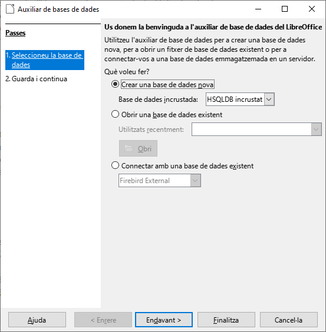
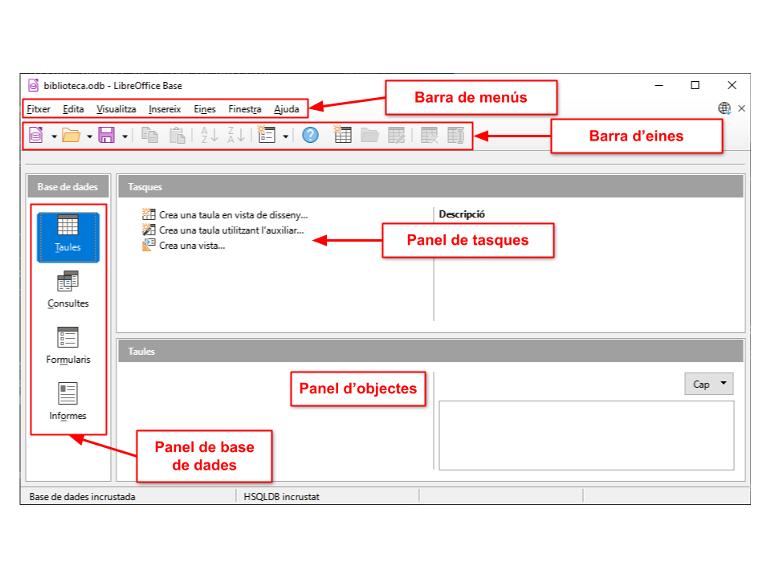

# 1. Introducció a *LibreOffice Base*

***LibreOffice Base*** és un programa de bases de dades que gestiona la creació i maneig d'aquestes, a més de possibilitar l'elaboració de formularis i informes que proporcionen als usuaris un accés fàcil a les dades. La seua interfície és senzilla, la qual cosa permet gestionar les bases de dades d'igual manera que aplicacions de característiques similars.

Base proporciona diverses característiques interessants com ara: l'habilitat d'analitzar i editar relacions a partir de la vista d'un diagrama, la incorporació de *HSQLDB com el seu motor de bases de dades relacional per defecte, la possibilitat d'utilització d'altres bases de dades en formats com *dBASE*, *MYSQL*, etc., o qualsevol base de dades compatible amb *ODBC* o *JDBC*.

A més de les característiques anteriors, ***Base*** inclou, igual que les altres aplicacions de la suite *LibreOffice*, multitud d'assistents i vistes per a fer el treball més fàcil als usuaris poc acostumats a aquesta mena de programes.

---

# 2. Operacions amb bases de dades

Els sistemes gestors de bases de dades permeten realitzar un conjunt d'accions sobre les bases de dades:

- **Obrir** una base de dades per a gestionar-la
- **Crear** una nova base de dades per a emplenar-la
- **Tancar** una base de dades ja oberta

El SGBD Base ofereix les operacions esmentades, encara que prèviament hem d'obrir-lo. Existeixen diferents formes depenent de la configuració del sistema operatiu, si bé principalment es pot arrancar de dues diferents:

- Fent doble clic sobre un **accés directe** situat en l'escriptori
- Accedint al menú de *LibreOffice* i prement sobre *LibreOffice Base*

Una vegada obert podem observar l'assistent per a bases de dades en el qual es mostren diferents opcions, tant per a crear una base de dades com per a obrir/connectar-se a una ja existent.

---

## 2.1. Creació d'una base de dades

### 2.1.1. Pas 1: Seleccioneu la base de dades

Per a crear una nova, seleccionem la primera opció "***Crear nova base de dades***".

---

### 2.1.2. Pas 2: Guarda i continua
Després, fem clic en el botó *****Endavant &gt;*****, la qual cosa ens portarà a una altra pantalla amb dues opcions (que hem de deixar amb els valors per defecte).

Les opcions són les següents:

- **Registrar la base de dades**. Serveix per a indicar a LibreOffice on localitzar les dades i com s'organitzen. És a dir, hem de registrar la nostra base de dades si volem que la informació que guardem siga localitzable des d'altres aplicacions. Per exemple, si en el processador de textos *Writer* volem mostrar una taula amb dades guardades en la nostra base de dades, hem de registrar-la abans.

- **Obrir la base de dades per a editar-la**. Tindre-la marcada perquè, si no, després de crear la base de dades es tancaria Base.

Prement el botó "***Finalitza***" s'obrirà un quadre de diàleg on hem d'indicar la carpeta en la qual s'emmagatzemarà la base de dades així com el nom amb el qual es guardarà. Per a acabar la creació premem el botó "***Guardar***" i s'obrirà la pantalla principal.

---

## 2.2. Obertura d'una base de dades

Per a obrir una base de dades existent seleccionarem la primera opció "***Obrir una base de dades existent***". Si hem estat treballat recentment amb l'arxiu, podem seleccionar-lo en el desplegable situat davall de l'opció anterior.

En cas contrari premerem el botó "***Obri***" i s'obrirà un dialogue on podem seleccionar la ruta de la base de dades (fitxer amb extensió *.ODB*).

---

# 3. Pantalla principal

Una vegada dins del programa, ens apareixerà una finestra amb l'aspecte de la figura següent (pot ser que el que veiem en l'ordinador no coincidisca exactament amb la imatge adjunta, però això és pel fet que l'aspecte del programa Base pot ser diferent per a cada usuari).

---

## 3.1. Barra de títol
És la barra superior de la finestra en la qual es mostra el nom de la base de dades activa. Fent doble clic en ella, la finestra canviarà de grandària maximitzant-se o de nou, amb un altre doble clic, recuperant la seua grandària original. Així podrem ampliar o disminuir ràpidament la grandària de la finestra del programa.

---

## 3.2. Barra de menús

Situada sota la barra de títol, la barra de menús **proporciona accés a totes les accions que poden realitzar-se en *Base*, organitzades en grups homogenis** atenent funcions semblants. Cada entrada permet accedir a les diferents funcions i per a activar-les podrem usar tant el teclat com el ratolí tal com estem acostumats en altres aplicacions de *LibreOffice*: en *Writer*, *Calc* o *Impress*, per exemple.

---

## 3.3. Barra d'eines estàndard

Situada sota la barra de menús, aquesta **mostra botons que permeten accedir a les funcions més habituals de *Base***: obrir, guardar, copiar i pegar, accedir a l'ajuda, formularis, botons específics per a taules, ordenar, etc. Podem veure per a què serveix cada botó gràcies als quadres informatius que apareixen en passar el punter del ratolí per damunt d'ells i es poden personalitzar de manera que només estiguen a la vista els botons que s'usen sovint.

---

## 3.4. Panel de base de dades

En la zona de l'esquerra on **es pot seleccionar el tipus d'objecte de la base de dades amb el qual es vol treballar**. En una base de dades de Base hi ha quatre tipus principals d'objectes: taules, consultes, formularis i informes. De moment només t'hem parlat del primer d'ells, però a mesura que avancem anirem veient per a què serveix cadascun dels objectes esmentats, com crear-los i com mantindre'ls.

---

## 3.5. Panel de tasques

En la zona central es troben les **tasques que es poden realitzar amb la mena d'objecte seleccionat**. Són eines diferents segons cadascun d'ells. Així, per exemple, en el cas de la captura de pantalla següent, l'objecte seleccionat són les Taules i podem veure en el panell Tasques les tasques que són possibles realitzar relacionades amb aquesta mena d'objectes.

---

## 3.6. Panell d'objectes

En la zona inferior apareixen els objectes creats del tipus seleccionat. En la figura es pot observar que dins del tipus taula, encara no tenim cap objecte creat.

---

# 4. Ajuda de Base

Dins de la barra de menús existeixen diferents possibilitats que ens brinden totes les funcionalitats del programa. L'últim de tots ells es diu Ajuda i en ell apareixen les diferents opcions d'ajuda de *LibreOffice*. Entre totes les opcions disponibles destaquen dues:

- **Ajuda de *LibreOffice*** que conté una ajuda extensa de totes les eines de *LibreOffice* classificada per continguts i amb l'opció inclosa de buscar ajuda recorrent l'índex de continguts o en funció d'una paraula clau.
- **Què és això?**, que permet que es mostre una xicoteta informació sobre l'objecte en el qual tinguem situat el cursor.
