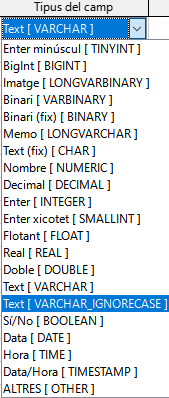
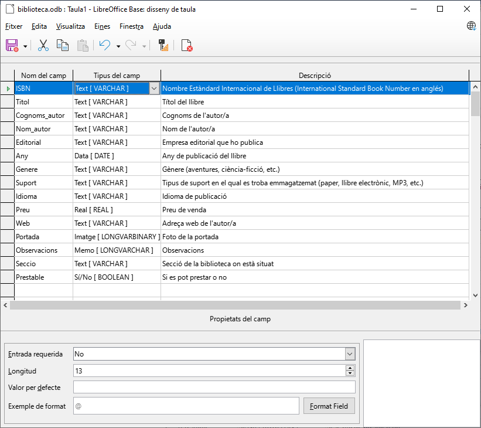
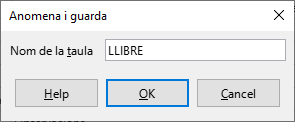
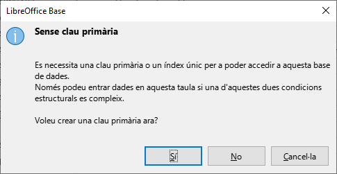
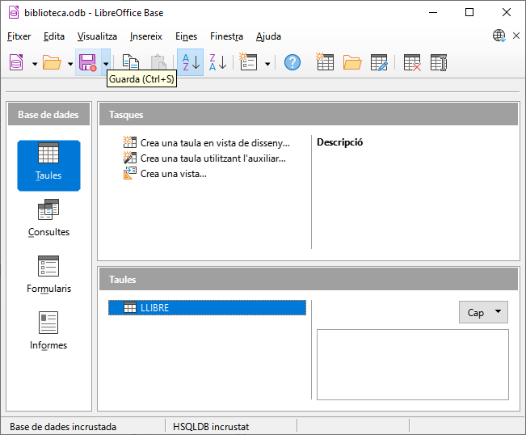

# 3. Taules. Elements d'una taula

Dins de les bases de dades existeix un element fonamental en el qual s'emmagatzemen les dades: les taules. En aquesta unitat aprendrem el concepte de taula així com els seus elements amb la finalitat que quede clar tant la seua utilitat com el seu significat.

> Una **taula** és un **objecte** que es defineix i utilitza per a **emmagatzemar dades**.

Una taula conté informació sobre un tema o assumpte particular, com pot ser amics, música, llibres, clients, comandes, etc.

> Les taules contenen **camps** que emmagatzemen les diferents dades. I al conjunt de camps per a un mateix objecte de la taula se'l denomina **registre** o **fila**. Les taules tenen una estructura molt similar a un full de càlcul:

## 3.1 Camps. Tipus i propietats

En l'estructura d'una taula destaquen una sèrie d'elements com són:

- Nom de camp
- Tipus de dades
- Propietats del camp

### 3.1.1 Nom del camp
El nom dels camps pot estar format per un màxim de 64 caràcters alfanumèrics (lletres i/o números). Encara que hui dia els SGBD permeten qualsevol caràcter, ÉS MOLT ACONSELLABLE (per no dir quasi obligatori) seguir les següents recomanacions en col·locar noms als camps:

- Posar **noms significatius** (Cognom, Nom, Telf, etc.) perquè l'usuari puga deduir les dades emmagatzemades en el camp.

- **NO incloure espais en blanc** dins dels noms de camp. Si es desitja que un nom de camp estiga compost per més d'una paraula, es pot unir amb el caràcter de subratllat (_). Exemple: Notes_Mensuals.

- **NO utilitzar caràcters especials** com a accents, $, &, @, #, %, Ç, etc.

>  ⚠️ Hem de prestar especial atenció al nom dels camps si volem assegurar-nos que funcionen bé les operacions sobre la base de dades.

### 3.1.2 Tipus de dades

El tipus de dades que s'especifique per a un camp determina les següents característiques:

- Tipus de dades que emmagatzemarà el camp (text, números, dates, etc.).
- L'espai que Base reservarà per a emmagatzemar el contingut del camp.
- Les operacions que es podran realitzar sobre el camp.
- La possibilitat d'utilitzar el camp com a clau principal.

La següent taula resumeix tots els tipus de dades de camp disponibles en Base, la seua utilització i la seua grandària d'emmagatzematge:

Tipus de dades | Significat | Grandària
-|-|-
**Text** | Text o combinacions de text i números. Així mateix, números que no requereixen càlculs com, per exemple, números de telèfon, números de peça o codis postals. | Fins a 255 caràcters. El més utilitzat és el tipus Text [*VARCHAR*].
**Nota** o **Memo** | Text i números de gran longitud com, per exemple, notes o descripcions. | Fins a 2.147.483.647 caràcters.
**Numèric** | S'utilitza per a emmagatzemar valors numèrics sobre els quals es podran realitzar operacions aritmètiques. | Depén del tipus: sencer, real, etc. Els més utilitzats són Sencer [*INTEGER*] i Real [*REAL*].
**Data/Hora** | Dates i hores. | 8 bytes. El més utilitzat és el tipus Data/Hora [*DATE*].
**Sí/No** | Camps que contindran només un de dos valors possibles, com Sí/No, Vertader/Fals, Activat/Desactivat. | 1 byte.
**Objecte** | Objectes creats en altres programes: per exemple, documents de *Writer*, fulls de càlcul de *Calc*, sons o altres dades binàries. | Fins a 2 gigaoctets (limitat per l'espai en disc). Tipus Binari [*VARBINARY*].
**Imatge** | Objectes imatge creats en altres programes. | Fins a 2 gigaoctets (limitat per l'espai en disc). Tipus Imatge [*LONGVARBINARY*].

En la imatge es mostren alguns dels possibles valors que poden tindre:

### 3.1.3 Propietats de camp

Depenent de la mena de dada, podem tindre fins a sis propietats que es poden configurar per a mantindre la consistència i el format de la informació introduïda. Les propietats es mostren en la part inferior de la pantalla.

Propietat | Significat
-|-
**Valor automàtic** | Si es posa afirmatiu permet que *Base* establisca automàticament un valor seqüencial a aquest camp. Se sol utilitzar quan tenim un enter al qual aniríem donant valors consecutius cada vegada que introduïm una nova fila. Només està disponible amb els tipus *Enter* [*INTEGER*] i *Enter gran* [*BIGINT*].
**Entrada requerida** | Serveix per a indicar si serà obligatori o no introduir un valor en aquest camp per a cada fila de la taula.
**Grandària o longitud** | Especifica la longitud màxima permesa.
Decimals | Serveix per a especificar quantes xifres de la grandària assignada seran decimals.
**Valor per defecte** | Permet assignar un valor per defecte per a aquest camp a totes les files que es vagen introduint.
**Exemple de format** | Permet especificar el format del camp. Molt útil sobretot per als camps de tipus Data i Hora per a indicar el format d'introducció d'aquests.

## 3.2 Creació de taulas

A continuació explicarem els passos per a la creació de taules, més concretament per a la gestió de la nostra biblioteca personal de llibres.

- Crear una nova base de dades: Biblioteca
- Feix clic sobre el botó ***"Taules"*** del panell de Base de dades.
- Crear taula **LLIBRE**:
  - Fes clic a la dreta, en l'opció ***"Crear taula en vista de disseny..."***
  - Es mostrarà una taula completament buida.
  - Introduirem els camps que s'indiquen a continuació:

Camp | Tipus | Longitud | Descripció
-|-|-|-
ISBN | Text [*VARCHAR*] | 13 | Nombre Estàndard Internacional de Llibres (*International Standard Book Number* en anglés)
Titol | Text [*VARCHAR*] | 100 | Títol del llibre
Cognoms_autor | Text [*VARCHAR*] | 50 | Cognoms de l'autor/a
Nom_autor | Text [*VARCHAR*] | 30 | Nom de l'autor/a
Editorial | Text [*VARCHAR*] | 50 | Empresa editorial que ho publica
Any | Data [*DATE*] | Per defecte | Any de publicació del llibre
Genere | Text [*VARCHAR*] | 20 | Gènere (aventures, ciència-ficció, etc.)
Suport | Text [*VARCHAR*] | 20 | Tipus de suport en el qual es troba emmagatzemat (paper, llibre electrònic, MP3, etc.)
Idioma | Text [*VARCHAR*] | 20 | Idioma de publicació
Preu | Real [REAL] | Per defecte | Preu de venda
Web | Text [*VARCHAR*] | 200 | Adreça web de l'autor/a
Portada | Imatge [*LONGVARBINARY*] | Per defecte | Foto de la portada
Observacions | Nota [*LONGVARCHAR*] | Per defecte | Observacions
Seccio | Text [*VARCHAR*] | 20 | Secció de la biblioteca on està situat
Prestable | Sí/No [*BOOLEAN*] | Per defecte | Si es pot prestar o no

  - Repetint el procés per als altres camps, el resultat serà similar al de la següent imatge:

- Guardar la taula
  L'últim pas serà l'emmagatzematge de la taula en la base de dades. Per a això:
  - Fes clic en la icona Guardar de la barra d'eines.
  - Es mostrarà una finestra en la qual introduirem el nom "LLIBRE":
  
  - Fes clic a ***"OK"*** i respon ***"Sí"*** al següent missatge:
  
  El missatge anterior apareix perquè no hem definit cap clau principal. Més endavant tractarem aquesta qüestió, però és necessari que es cree per a poder introduir dades en la taula. Una vegada realitzats els passos anteriors quedarà l'estructura de la següent manera:
- Si hem seguit tots els passos correctament, la nostra taula LLIBRE ha d'aparéixer dins de l'apartat Taules en la part inferior de la finestra principal de Base:

- Guarda els canvis. 
- Tanca la base de dades "*biblioteca*".