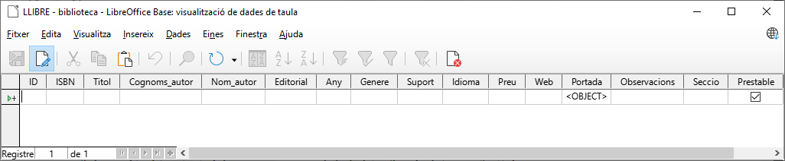

# 4. *LibreOffice Base*: Format, edició, validació, ordenació i filtrat de dades

## 🎯 Objectius
- Conéixer i utilitzar els formats per a mostrar els camps.
- Concepte de camp. Identificar l'estructura d'una taula.
- Concepte de fulla de dades.
- Operacions de manipulació de dades: alta, modificació i esborrat.
- Conéixer i utilitzar la propietat valor per defecte. Conéixer i utilitzar la propietat camp requerit.
- Ordre ascendent i descendent de dades.
- Operacions de filtrat de dades. Operacions de cerca de dades.

---

# 4.1 Propietat Format

Els camps tenen diferents característiques que permeten la seua personalització dins d'un rang determinat de valors. Gràcies a ells podem especificar i afinar el tipus d'element així com la seua estructura.

> La propietat Format determina la manera en què es mostraran les dades en un camp d'una taula, però NO els modifica.

Podem utilitzar l'Assistent per a formats o podem escriure directament la màscara en el camp.

Aquesta propietat és important en molts camps però, possiblement, on més cura cal tindre amb ella és en els camps de tipus "temps" per a no tindre problemes quan introduïm dates i hores.

--- 

# 4.2 Assistent per a formats

L'assistent ens permet triar entre una sèrie de formats preestablits. Per a executar l'assistent anirem al camp i en la propietat `Exemple de format` farem clic en el botó situat a la dreta.

Existeixen diferents tipus entre els quals trobem:

- Text
- Numèric
- Data
- Hora
- Científic
- Moneda
- Percentatge
- Valor booleà
- Fracció

---

## 4.2.1 Tipus Numèric
Totes aquestes màscares estableixen el format amb el qual es visualitzarà el camp numèric. Disposem de les mateixes opcions que en el full de càlcul *Calc*.

- **Decimals**. Indica el nombre de decimals a mostrar.
- **Zeros inicials**. Nombre màxim de zeros davant de la coma decimal.
- **Negatiu en roig**. Els números negatius es visualitzen en color roig.
- **Separador de milers**. Els milers se separen amb punt.

---

## 4.2.2 Tipus Data

Totes aquestes màscares restringeixen l'entrada de dates.

- **Llengua**. En la part superior dreta podem elegir l'idioma. L'elecció d'idioma no és un tema trivial ja que, per exemple, els formats de data predefinits no seran els mateixos per a idiomes de països anglosaxons que per a països europeus continentals.
- **Format**. Existeixen una sèrie de formats predefinits que es mostren en la finestra superior central. Un exemple de com es veuria el format triat es mostra en el rectangle que apareix en el centre de la finestra a la dreta.
- **Codi de format**. Tots els formats predefinits poden ser adaptats per l'usuari i guardats per al seu ús posterior.

---

## 4.2.3 Tipus Hora

Totes aquestes màscares restringeixen l'entrada de temps i són similars a les anteriors.

- **Llengua**. En la part superior dreta podem elegir l'idioma. L'elecció d'idioma no és un tema trivial ja que, per exemple, els formats d'hora predefinits no seran els mateixos per a idiomes de països anglosaxons que per a països europeus continentals.
- **Format**. Existeixen una sèrie de formats predefinits que es mostren en la finestra superior central. Un exemple de com es veuria el format triat es mostra en el rectangle que apareix en el centre de la finestra a la dreta.
- **Codi de format**. Tots els formats predefinits poden ser adaptats per l'usuari i guardats per al seu ús posterior. En l'exemple es mostrarien dos dígits per a les hores, dues per als minuts i dos per als segons.

---

## 4.2.4 Tipus Científic

Totes aquestes màscares restringeixen l'entrada de números en notació científica.

- *Decimals*. Indica el nombre de decimals a mostrar.
Zeros a l'esquerra. Nombre màxim de zeros davant de la coma decimal.
- *Negatiu en roig*. Els números negatius es visualitzen en color roig.
- *Format*. Existeixen una sèrie de formats predefinits que es mostren en la finestra superior central. Únicament existeixen dos, un amb tres números per a l'exponent i un altre per a dos.
- *Format de codi*. Tots els formats predefinits poden ser adaptats per l'usuari i guardats per al seu ús posterior. En l'exemple es mostraria un dígit sencer, dos decimals i dos per a l'exponent.

---

# 📝 *Activitat 2: Formatació de camps*

- Edició de la taula ***LLIBRE***
  - Obri la base de dades "**Biblioteca**".
  - Fes clic en el botó Taules del panell de Base de dades.
  - Selecciona la taula **LLIBRE**.
  - Edita la taula fent clic en la icona Editar de la barra d'eines. 
- Format del camp ***Any de publicació***
  - Selecciona el camp `Any` i en el panell de propietats inferior fes clic en el botó amb punts suspensius del camp `Exemple de format`.
  - Tria la categoria `Data`. Fins ara el nostre camp `Any` estava predefinit com `DD/MM/AA`; és a dir, dues xifres per al dia, dos per al mes i dos per a l'any.
  - En el camp `Codi de format` tecleja `AAAA` (o `YYYY` si tens configurat LibreOffice en anglès). Després, prem la icona de la dreta  `✔️` `Afig`.
  - Comprova que s'ha afegit el nou format.
  - Fes clic en el botó `OK`.
- Format del camp ***Preu***
  - Ara selecciona el camp `Preu` i en el panell de propietats inferior selecciona el botó a la dreta del camp `Exemple de format`.
  - Selecciona la categoria `Moneda`.
  - Fes clic a `OK`.

---

# 4.3 Full de dades

Una vegada tenim les taules creades juntament amb els formats necessaris, el següent pas és la seua edició, ja que habitualment requerirem inserir dades, modificar els ja existents o eliminar-los.

Després de crear la nostra taula, aprendrem a editar files de dades; és a dir, en el nostre cas, editarem les dades de cada llibre per a modificar el seu contingut.

Podem editar dades a través del que es coneix com a full de dades. Per a obrir-la tenim 3 mètodes:

- Fer `doble clic` sobre el nom de la taula en el panell d'objectes.
- Fer clic en la icona `Obri objecte de base de dades`.
- Fer clic amb el `botó dret del ratolí` sobre la taula en el panell d'objectes i seleccionar l'opció `Obri...`.

En la pantalla que es mostrarà es permet la **inserció**, **modificació** i **eliminació** de les dades de la base de dades. El primer que observarem serà una fletxa blava situada en la part esquerra de la finestra. El registre que es correspon amb el camp ressaltat es denomina registre actiu. També podrem observar que apareixeran totes les columnes que hàgem creat prèviament en la definició de la taula i, en cas de ser la primera vegada que accedim per a inserir dades aquestes estaran buides:

Fins al moment només hem definit l'estructura, és a dir, l'esquelet de la taula, però no hem introduït cap dada. L'estructura defineix què és el que va contindre la nostra taula, però no conté informació.

D'altra banda, en la imatge superior, veiem que la columna `Prestable` apareix amb un quadrat. Aquest quadrat ens indica que és un camp del tipus “Sí/No” i que aparega amb fons blau significa que no hi ha cap opció triada de moment. En introduir dades, marcarem amb el ratolí. Si està marcada significa `SI` i si està desmarcada, significa `NO`.

---

# 4.4 Inserció de dades

Per a realitzar la inserció de dades hem de seguir els següents passos:

- Obrir la base de dades per a edició.
- Situar-nos en l'últim registre, el qual està marcat amb la icona de `Nou registre`.
- Escriure la primera dada del nou registre i prémer `Intro`.
- Repetir el pas anterior fins a completar les dades del registre.
 	 
> ⚠️ Quan inserim registres en una taula, el programa els guarda automàticament en activar qualsevol altre registre o quan tanquem el full de dades en la qual estem treballant.

 	 
> ⚠️ Per a introduir l'any escriurem el dia 1 de gener de l'any de publicació, és a dir, si és l'any `2000` teclejarem `1/01/2000` o `1/01/00`. El format definit per al camp s'encarregarà de mostrar automàticament només l'any amb 4 dígits.

---

# 📝 *Activitat 3: Inserció de dades*

Taula LLIBRE. Introducció de dades

- Obri la taula `LLIBRE`.
- Introdueix, almenys, 5 registres amb informació de cada llibre. Emplena els registres un a un. Pot introduir-se les dades que es desitge. Per exemple:
  - LLIBRE 1
    - ID: 1
    - ISBN: 9788411111111
    - Titol: El Quijote de la Mancha
    - Cognoms_autor: De Cervantes Saavedra
    - Nom_autor: Miguel
    - Editorial: Segle d'Or
    - Any: 2016 
    - Genere: Novel·la humor
    - Suport: Paper
    - Idioma: Espanyol
    - Preu: 9,45 €
    - Web: https://es.wikipedia.org/wiki/don_quijote_de_la_mancha
  - LLIBRE 2
    - ID: 2
    - ISBN: 9788422222222
    - Titol: Tirant lo Blanc
    - Autor: Joanot Martorell
    - Editorial: Regne de València
    - Any: 2017
    - Genere: Novel·la cavalleries
    - Suport: Paper
    - Idioma: Valencià
    - Preu: 19,99 €
    - Web: https://es.wikipedia.org/wiki/tirante_el_blanco
  - LLIBRE 3
    - ID: 3
    - ISBN: 9788433333333
    - Titol: Fray Bernardino de Minaya y su tiempo
    - Autor: Daniel Sánchez Ortega
    - Editorial: Minaya
    - Any: 1997
    - Genere: Biografia
    - Suport: Paper
    - Idioma: Espanyol
    - Preu: 9,02 €
    - Web: https://muydeminaya.jimdofree.com/nuestra-historia/personajes-historicos/fray-bernardino-de-minaya/
  - LLIBRE 4
    - ID: 4
    - ISBN: 9788444444444
    - Titol: Veles e Vents
    - Autor: Ausiàs March
    - Editorial: Regne de València
    - Any: 2018
    - Genere: Poesia
    - Suport: Paper
    - Idioma: Valencià
    - Preu: 16,99 €
    - Web: https://es.wikipedia.org/wiki/veles_e_vents
  - LLIBRE 5
    - ID: 5
    - ISBN: 9788455555555
    - Titol: Robinson Crusoe
    - Autor: Daniel Defoe
    - Editorial: Viernes S.L.
    - Any: 2012
    - Genere: Aventures
    - Suport: Paper
    - Idioma: Espanyol
    - Preu: 11,20 €
    - Web: https://es.wikipedia.org/wiki/robinson_crusoe
- 💾 Guarda els canvis.

---

# 4.5 Navegació entre registres
En la part inferior de la finestra podem veure la Barra de navegació entre registres. Utilitzarem els botons de desplaçament per a desplaçar-nos amb rapidesa entre registres.

En aquesta barra se'ns mostra la fila actual en la qual estem, així com els botons, per aquest ordre, per a anar a la primera fila, a l'anterior, a la següent, a l'última o crear una nova.

A més de la barra, podem utilitzar el teclat amb les següents tecles o combinacions:
- `Tab`: situa el cursor en el camp següent al registre actiu
- `Majús + Tab`: situa el cursor en el camp anterior al registre actiu
- `Fletxa a dalt` `⬆`: situa el cursor en el camp del registre anterior
- `Fletxa a baix` `⬇`: situa el cursor en el camp del registre següent

---

# 4.6 Modificació de dades

Les dades d'una base de dades són dinàmics, ja que poden patir variacions al llarg del temps o fins i tot desaparéixer per diferents motius. Modificar i eliminar dades de les nostres taules és un procés simple i comú que no representa cap problema.

Per a poder modificar les dades d'una taula cal tindre activada l'edició de dades mitjançant el botó `📝` `Edita les dades` de la barra d'eines. Una vegada activat veurem el canvi ja que la primera cel·la s'acolorirà en blava.

Quan s'ha modificat la dada, la icona de la fletxa blava (registre actiu) es canviarà al de modificació.

Per a modificar el valor d'un camp d'alguna fila en particular, ens situem amb el cursor en el valor a canviar i el reescrivim. En el cas dels camps `Sí/No`, n'hi ha prou amb marcar o desmarcar la casella.

---

# 4.7 Esborrat de dades

Per a esborrar una fila sencera, n'hi ha prou amb situar-se amb el cursor a l'inici de la fila i amb el botó dret del ratolí seleccionar `Suprimir les files`. També podem anar al menú `Editar` → `Suprimeix el registre`.

L'eliminació d'un registre suposa la pèrdua de les seues dades sense possibilitat de recuperació, és per això que, abans de realitzar l'esborrat, es mostrarà un avís per a confirmar-lo. En cas d'estar segurs de l'eliminació haurem de seleccionar l'opció `Sí`.

---

# 4.8 Propietat ***Valor per defecte***

A l'hora de dissenyar una base de dades és necessari definir la manera de mantindre la **integritat** de les dades que seran emmagatzemats en ella. La integritat de les dades depén, entre altres coses, que la taula només continga dades vàlides. Base ofereix algunes característiques per a aconseguir-ho, que detallem a continuació.

Mitjançant aquesta propietat podem establir un valor per defecte per a un camp. D'aquesta manera, quan es cree un nou registre, en aquest camp apareixerà el valor predeterminat. Aquest valor pot modificar-se, igual que la resta de dades del registre encara que haurà de ser del mateix tipus que el fixat en el camp.

---

# 4.9 Propietat ***Entrada requerida***

En molts casos ens trobem que hi ha camps que són informació fonamental del nostre interés, mentre uns altres són opcionals. La propietat `Entrada requerida` **obliga l'usuari a introduir dades en un camp** per a poder guardar el registre. D'aquesta manera, aquest camp no podrà contindre valors nuls, és a dir, no podrà estar buit.

---

# 📝 *Activitat 4: Edició i validació de dades*

Taula LLIBRE. Edició

- Obri la taula `LLIBRE` per a **edició**.
  - Camp *ISBN*
    - Selecciona el camp `ISBN` en la taula.
    - En la part inferior, estableix la propietat `Entrada requerida` a `Sí`.
  - Camp *Títol*
    - Selecciona el camp `Titol` en la taula.
    - En la part inferior, estableix la propietat `Entrada requerida` a `Sí`.
- Camp *Cognoms de l'autor*
  - Valor per defecte.
    - Selecciona el camp `Cognoms_autor` en la taula.
    - En la part inferior es mostraran les propietats del camp.
    - Ves al `Valor per defecte` i escriu el valor `Sense cognoms`
  - Estableix com **requerit** el camp `Cognoms_autor` en la taula, seguint els mateixos passos que en el camp anterior.
- Camp *Nom de l'autor*
  - Valor per defecte.
    - Selecciona el camp `Nom_autor` en la taula.
    - Ves al `Valor per defecte` i escriu el valor `Sense nom`
  - Estableix com **requerit** el camp `Nom_autor` en la taula, seguint els mateixos passos que en el camp anterior.
- Camp *Preu*
  - Valor per defecte.
    - Selecciona el camp `Preu`.
    - Ves al `Valor per defecte` i escriu el valor `0`
- Camp *Prestable*
  - Valor per defecte.
    - Selecciona el camp `Prestable` en la taula.
    - Ves al `Valor per defecte` i estableix el valor a `Sí`
- 💾 Guarda els canvis.
- Tanca la vista disseny.

- **Introduir dades**
  - Per a comprovar que s'han realitzat correctament les modificacions, provarem d'**inserir un nou registre** en la taula i observarem que apareix, en els camps que hem modificat, el valor per defecte fixat:
  - Obri la taula `LLIBRE` per a introduir dades.
  - Inserta dos registres nous:
    - ***LLIBRE 6***
      - **ID**: 6
      - **ISBN**: 9788466666666
      - **Títol**: Platero i jo
      - **Autor**: 
      - **Editorial**: Nobel
      - **Any**: 2007
      - **Gènere**: Lírica
      - **Suport**: Paper
      - **Idioma**: Espanyol
      - **Preu**: 8,95 €
      - **Web**: https://es.wikipedia.org/wiki/platero_y_yo
    - ***LLIBRE 7***
      - **ID**: 7
      - **ISBN**: 9788477777777
      - **Títol**: Estudi en escarlata
      - **Autor**: Arthur Conan Doyle
      - **Editorial**: Detectiu
      - **Any**: 2011
      - **Gènere**: Suspens
      - **Suport**: Paper
      - **Idioma**: Anglés
      - **Preu**:
      - **Web**: https://es.wikipedia.org/wiki/sherlock_holmes
- 💾 Guarda els canvis.

---

# 4.10 Ordenació de dades

Un dels elements més importants en una taula és l'ordenació, ja que permet veure, d'una passada, els registres de manera organitzada. A més, el filtrat permetrà posar l'èmfasi en aquelles dades sobre els quals volem obtindre informació. En aquesta unitat aprendrem a organitzar i filtrar les dades per a obtindre només els que volem.

Els registres es mostren en la taula ordenats, per defecte, segons el contingut d'un determinat camp, més concretament el que s'haja definit com a clau primària (concepte que s'estudiarà més endavant). Així i tot, i si ho requerim ordenar, simplement cal assenyalar sobre el nom de la columna desitjada i triar si volem que ordene les files ascendent o *descendentemente.

Passos a seguir:

- Obrim la base de dades.
- Obrim la taula i activem l'edició de dades.
- Seleccionem la columna que volem ordenar, per exemple `Preu`.
- Seleccionem la icona d'`Ordre ascendent` o `Ordre descendent`

---

# 4.11 Filtrat de dades

Existeixen ocasions en les quals interessa visualitzar o treballar amb un únic grup de registres i ocultar els altres. Per a això podem utilitzar les opcions de filtrat, les quals ens permeten triar de manera simple quines dades volem que es mostren. Les quatre opcions, per l'ordre en què apareixen els botons, són:

Filtre | Acció
-|-
**Filtre automàtic** | Permet mostrar les files el contingut de les quals compleix amb els criteris del filtre.
**Aplica filtre** | Permet activar o desactivar el filtre. Si premem el botó una vegada aplicat el filtre anterior, la taula es mostrarà com el feia sense filtre.
**Filtre estàndard** | Permet establir les opcions del filtre de manera semblant a com establíem els criteris d'ordenació.
**Suprimeix el filtre/l'ordenació** | Permet tornar a mostrar la taula com ho feia sense filtre. És similar al cas d'Usar filtre encara que en aquest no es pot tornar a aplicar el filtre llevat que premem l'opció de Filtre automàtic o Filtre estàndard.

Veurem els diferents tipus de filtres amb l'exemple de la base de dades biblioteca.

---

# 4.12 Cerca de dades

Una altra de les opcions interessants que posseeix Base és la de permetre la cerca de registres. Per a això la taula ha d'estar oberta per a introducció de dades i prémer la icona .

Una vegada premem el botó es mostrarà una finestra amb diferents opcions per a la cerca.

Entre les opcions trobem:
- **Text**: caràcters a buscar en la taula
- **Àmbit de busca**: permet indicar si la cerca es realitzarà en tots els camps o en camps individuals (que podem seleccionar)
- **Configuració**: ofereix diferents possibilitats de cerca com:
  - Posició dels caràcters a buscar
  - Buscar cap avant o cap endarrere
  - Usar expressions com a comodins (com per exemple `*` per a indicar un conjunt de caràcters)
  - Fer que coincidisquen les majúscules i les minúscules amb les dels caràcters a buscar

---

# 📝 *Activitat 5: Ordenació, filtrat i cerca de dades*

- **Ordenar dades per columnes**
  - Obri la taula `LLIBRE` per a introducció de dades (doble clic sobre la taula).
  - Ves a la columna `Titol` i fes clic en la icona d'`Ordre descendent`. 
  - Ara els llibres es mostraran ordenats per ordre alfabètic descendent del títol.
  - 📷 Captura la pantalla i guarda-la com a "***ordre***".
  - Per a restaurar l'ordre inicial per `ID` bastarà amb anar a la columna `ID` i aplicar l'ordre ascendent. 
  - Prova a utilitzar l'ordre descendent en una altra columna (la que tries).
  - Restableix l'ordre ascendent per `ID`.

- **Filtre automàtic**
  - Filtrarem la taula `LLIBRE` pel camp `Suport` de manera que es mostren només aquells llibres en suport `paper`.
  - Selecciona a la columna `Suport`.
  - Selecciona qualsevol llibre que tinga com a suport `Paper`.
  - Fes clic sobre la icona `Filtre automàtic`.
  - 📷 Captura la pantalla i guarda-la com "***filtreautom***".
  - Elimina el filtre fent clic a `Suprimeix el filtre/l'ordenació`.

- **Filtre estàndard**
  - Ara aplicarem un filtre amb criteris. Per a això suposem que només volem que es mostren aquells `llibres` amb `preu` de `més de 10€`.
  - Ves a la columna `Preu` i fes clic en el botó `Filtre estàndard`. 
  - Posa els criteris:
    - Nom de camp: `Preu`
    - Condició: `>`
    - Valor: `10`
  - Prem `OK`.
  - Ara només es mostraran els llibres de més de 10€.
  - 📷 Captura la pantalla i guarda-la com "***filtreest1***".
  - Elimina el filtre fent clic a `Suprimeix el filtre/l'ordenació`.

- **Aplicar filtres addicionals**
  - Aplica el següent filtre estàndard: 
    - Els llibres el preu dels quals siga major de 5 euros i l'idioma dels quals siga "Español" o "Valencià".
  - 📷 Captura la pantalla i guarda-la com "***filtreest2***".
  - Elimina el filtre fent clic a `Suprimeix el filtre/l'ordenació`.

- **Cerques de dades**
  - A continuació realitza les següents cerques en la taula LLIBRE, fent captures de pantalla dels resultats:
  - Els llibres el cognom dels quals de l'autor comence per la lletra "M". Per a això hem d'utilitzar el caràcter comodí * (per a indicar un conjunt de caràcters). També serà necessari prémer l'opció Expressió comodí, ja que en cas contrari no funcionaria la cerca:
  - Fes clic a Buscar. Base se situarà en el primer registre que complisca amb els criteris establits. Si continuem fent clic en el botó Buscar, el programa anirà passant al següent llibre que complisca els criteris.
  - 📷 Captura la pantalla (en el registre de cerca que vulgues) i guarda-la com "***cerca***".

- **Tancar la base de dades**
  - Tanca la base de dades "biblioteca" sense guardar els canvis (per a no introduir cap filtre).

- **Lliurament de les imatges**
  - Puja les imatges capturades "ordre.png", "filtreautom.png", "filtreest1.png", "filtreest2.png" i "cerca.png" a la plataforma.
