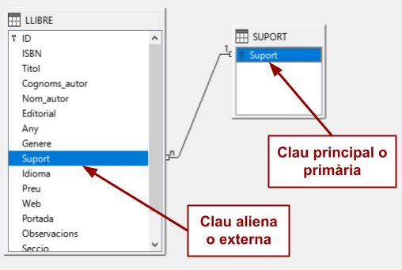

UD11: Bases de dades (I)

# 6. *LibreOffice Base*: Relacions entre taules. Integritat referencial

##  🎯 Objectius
- Conéixer el concepte de relació.
- Conéixer el concepte de clau aliena.
- Crear i utilitzar relacions entre taules.
- Concepte d'integritat referencial.
- Comprovació de la integritat referencial.

---

# 6.1 Bases de dades relacionals

Base, tal com es va comentar amb anterioritat, és un **gestor de base de dades relacional**, entre altres coses, perquè permet establir **vincles o relacions entre les taules** que el componen. L'objectiu d'aquestes relacions serà principalment **evitar la duplicitat d'informació** i en conseqüència, **optimitzar el rendiment** de la base de dades.

---

# 6.2 Relacions entre taules

Després de crear taules diferents en la base de dades, necessitem una manera d'indicar-li a *Base* com ha de tornar a combinar aqueixa informació.

El primer pas d'aquest procés és definir relacions entre les taules. Una vegada realitzada aquesta operació, podem crear consultes, formularis i informes per a mostrar informació de diverses taules alhora.

**Una relació fa coincidir les dades dels camps clau** (normalment un camp amb el mateix nom en totes dues taules). En la majoria dels casos, aquests camps coincidents són la **clau principal** d'una taula, que proporciona un identificador únic per a cada registre, i una **clau externa** de l'altra taula.

---

## *Exemple pràctic: centre educatiu*
Per a explicar-ho, mostrarem un exemple de base de dades d'un centre educatiu amb dues taules com són `Alumnes` i `Grups`. Inicialment estaran definides de la següent manera:

 Alumnes       | Grups
 --------------|--------------
 Expedient     | Denominacio
 Nom           | NombreAlumnes
 Cognoms       | Ubicacio
 DataNaixement | Observacions
 Grup          | 
 UbicacioGrup  | 
 ObservacionsGrup | 

En la taula `Alumnes` tenim tota la informació que necessitem sobre els nostres alumnes com:

- El seu número d'expedient.
- El seu nom i cognoms.
- La seua data de naixement.
- El grup al qual pertany l'alumne.
- La ubicació del grup, és a dir, l'aula on estan els alumnes d'aqueix grup *(Primera planta, edifici annex, etc)*.
- Qualsevol tipus de comentari d'interés.

Per a la taula `Grups` tenim:

- Denominació del grup: *1SMX-D, 2SMX-D, 1ASIR-A, 1DAW-SEMI, etc.*
- Nombre total d'alumnes que té el grup.
- El lloc on està situat: Planta baixa*, Primera planta, Segona planta, etc.*
- Qualsevol altra dada d'interés: *Reforç, Suport, etc.*

Si ens fixem en les dades podem adonar-nos que, en comprovar les dades incloses en les taules d'Alumnes i Grups, existeix **informació que es repeteix** en ambdues:

### ALUMNES:

Expedient | Nom    | Cognoms      | DataNaixement | Grup        | UbicacioGrup      | ObservacionsGrup 
----------|--------|--------------|---------------|-------------|-------------------|------------------
3256      | José   | Pérez García | 27/07/04      | *1SMX-D*    | **Planta baixa**  | **Refroç**
3259      | Juan   | Sánchez Pla  | 17/02/06      | *1SMX-D*    | **Planta Baixa**  | **Reforç**
3272      | Felipe | Sainz Paso   | 21/09/05      | *2ASIR-A*   | **Segona Planta** | **Taller**
3261      | María  | Delgado Vila | 01/10/03      | *1DAW-SEMI* | **Semi**          | **Remot**

### GRUPS:

Denominacio | NombreAlumnes | Ubicacio             | Observacions
------------|---------------|----------------------|---------------
1SMX-D      | 24            | ***Planta baixa***   | ***Refroç***
2SMX-D      | 19            | Segona Planta        | Cap
2ASIR-A     | 20            | ***Segona Planta***  | ***Taller***
1DAW-SEMI   | 27            | ***Semi***           | ***Remot***

Aquesta situació no és massa favorable quan treballem amb bases de dades on habitualment la quantitat d'informació que es maneja és important.** La solució passa per relacionar les taules amb informació coincident de manera que no existisca duplicitat d'informació**. Tot això, traduït a un llenguatge més natural seria: "Per a què escriure dues vegades el mateix, si puc fer-ho una sola i treballar de la mateixa manera".

 Alumnes       | Grups
 --------------|-
 Expedient     | Denominacio
 Nom           | NombreAlumnes
 Cognoms       | Ubicacio
 DataNaixement | Observacions
 Grup          | 
 *x* *~~UbicacioGrup~~*  | 
 *x* *~~ObservacionsGrup~~* | 

Tornant al nostre exemple, si relacionem les taules `Alumnes` i `Grups` mitjançant el nom del grup seria suficient amb indicar en la taula `Alumnes` aquest valor per a obtindre el nombre d'alumnes del grup, la seua ubicació i les possibles observacions:

### ALUMNES:

Expedient | Nom    | Cognoms      | DataNaixement | *Grup*    | *~~UbicacioGrup~~*  | *~~ObservacionsGrup~~* 
----------|--------|--------------|---------------|-------------|---------------------|------------------
3256      | José   | Pérez García | 27/07/04      | *1SMX-D*    | *~~Planta baixa~~*  | *~~Refroç~~*
3259      | Juan   | Sánchez Pla  | 17/02/06      | *1SMX-D*    | *~~Planta Baixa~~*  | *~~Reforç~~*
3272      | Felipe | Sainz Paso   | 21/09/05      | *2ASIR-A*   | *~~Segona Planta~~* | *~~Taller~~*
3261      | María  | Delgado Vila | 01/10/03      | *1DAW-SEMI* | *~~Semi~~*          | *~~Remot~~*

### GRUPS:

Denominacio | NombreAlumnes | Ubicacio             | Observacions
------------|---------------|----------------------|---------------
1SMX-D      | 24            | ***Planta baixa***   | ***Refroç***
2SMX-D      | 19            | Segona Planta        | Cap
2ASIR-A     | 20            | ***Segona Planta***  | ***Taller***
1DAW-SEMI   | 27            | ***Semi***           | ***Remot***

---

# 6.3 Tipus de relacions

Les condicions per a establir vincles entre dues taules no són sempre iguals, ja que la manera en què es relacionen les taules entre si dona lloc a comportaments diferents. En l'estructura de qualsevol base de dades trobem principalment tres tipus de relacions que es descriuen de la següent manera:

- Un a molts `(1:N)`
- Un a un `(1:1)`
- Molts a molts `(N:N)`

## 6.3.1 Relació `un a molts` `(1:N)`

Aquest tipus es dona quan una fila de la primera taula pot estar relacionada amb moltes files de la segona taula, però una fila de la segona només està relacionada amb una de la primera.

### *Exemple. Base de dades d'un centre educatiu*

Si tornem a la base de dades d'un centre educatiu amb dues taules com són `Alumnes` i `Grups`, tenim que:

- Dotan `1 alumne`, només pot pertànyer a `1 grup`.
- Donat `1 grup`, pot tindre `molts alumnes`.

### *Altres exemples*

Altre exemple d'aquesta mena de relacions podria ser entre una taula amb àrbitres i una altra amb partits de tennis, ja que:

- Donat `1 àrbitre`, pot haver arbitrat `molts partits` de tennis.
- Donat `1 partit` de tennis, només ha sigut arbitrat per `1 àrbitre`.

## 6.3.2 Relació `un a un` `(1:1)`

Aquest tipus de relació apareix amb menys freqüència i succeeix quan una fila de la primera taula només pot estar relacionada amb una fila de la segona i una fila de la segona taula només pot estar relacionada amb una de la primera.

### *Exemple. Base de dades d'un centre educatiu*

Si tornem a la base de dades d'un centre educatiu, tenim que un altre exemple seria el d'un tutor amb un grup:

- Cada `grup` només pot tindre `1 tutor`
- Cada `tutor` només pot tindre `1 grup`

```
                       1                      1 
        +------------+                          +-------------+
        |    GRUP    | <----------------------> |    TUTOR    |
        +------------+                          +-------------+
```

### *Altres exemples*

Altre exemple d'aquesta mena de relacions podria ser entre una taula amb països i una altra amb caps de govern:

- Donat `1 país` només té `1 cap de govern` (normalment).
- Donat `1 cap de govern`, ho és només de `1 país`.

## 6.3.3. Relació `molts a molts` `(N:N)`

Aquesta classe de relació ocorre quan una fila de la primera taula pot estar relacionada amb moltes files de la segona taula i una fila de la segona taula pot estar-ho amb moltes files de la primera.

Aquest tipus de relació només és possible si es defineix una tercera taula (denominada taula d'unió) la clau principal de la qual consta d'almenys dos camps: les claus externes de les Taules A i B. Posteriorment tractarem el concepte de clau aliena o externa.

### *Exemple. Base de dades d'un centre educatiu*

Si tornem a la base de dades d'un centre educatiu, tenim que un altre exemple seria el d'un institut on les taules `PROFESSORS` i `GRUPS` estan relacionades:

- `1 professor` pot impartir classe a `molts grups`
- `1 grup` pot tindre `molts professors`

```
                         N                           N 
        +--------------+                               +--------------+
        |   PROFESSOR  | <---------------------------> |     GRUP     |
        +--------------+                               +--------------+
```


### *Altres exemples*

Altre exemple d'aquest tipus el tenim en la relació entre una taula amb pel·lícules i una taula amb intèrprets (actors) perquè:

- Feta `1 pel·lícula` en particular, pot tindre `molts actors`
- Donat `1 actor`, aquest pot haver intervingut en `moltes pel·lícules`

---

# 6.4 Relacions en la base de dades de "*Biblioteca*"

Si ens fixem en la base de dades `Biblioteca` podem veure que s'està repetint el mateix valor moltes vegades: per exemple, el valor de suport `Paper` apareix en diverses files. És a dir, en introduir el mateix valor de manera redundant s'està possibilitant que en algun moment l'escriguem malament, per exemple, `Papek`, i tinguem un nou suport que no correspon a cap llibre, ja que ni tan sols existeix.

Pot ocórrer també que tots els tècnics de biblioteconomia es posen d'acord i decidisquen que el suport `Paper` no té un nom adequat i que és millor anomenar-lo `Paper-clàssic`. Llavors, en la taula `LLIBRE`, s'ha d'anar un a un canviant el nom i amb cura de no equivocar-se en teclejar. Potser si tenim quatre llibres en aquest suport no ens semble un gran inconvenient fer aquest canvi quatre vegades, però si resulta que és una col·lecció de tres-cents llibres d'aquest suport pot ser que l'esforç semble més important.

La solució als problemes anteriors està a **separar la informació que apareix repetida** contínuament en una nova taula `SUPORT` i indicar d'alguna forma en la nostra base de dades que hi ha files de la taula `LLIBRE` i de la taula `SUPORT` que estan relacionades.

---

# 6.5 Establir una relació `un a molts` `(1:N)`

A l'hora d'establir una relació un a molts entre dues taules és indispensable que es complisquen **3 CONDICIONS**:

- Totes dues taules han de tindre un **camp en comú**.
- Tots dos camps hauran de tindre el **mateix tipus** (*INTEGER*, *TEXT*, *SMALL* *INTEGER*, *etc*.) i la **mateixa grandària**.
- Un dels camps haurà de ser **clau primària** en una de les dues taules.

## 6.5.1. Clau aliena o externa

El camp relacionat de la taula `molts` es denomina **Clau `aliena` o `externa`**.

### *Base de dades: Biblioteca*

Segons hem explicat prèviament, existeix clarament una relació entre les taules `LLIBRE` i `SUPORT`. Si considerem (per a simplificar) que UN LLIBRE NOMÉS POT ESTAR PUBLICAT EN UN SUPORT, el tipus de relació que existeix entre la taula `SUPORT` i la taula `LLIBRE` seria del tipus `un a molts` `(1:N)`, ja que:

- Per exemple, el suport `Paper` tindrà diversos llibres relacionats que estan en aquest suport.
- Donat un llibre, només està publicat en una mena de suport.
- I el camp `Suport` de la taula `LLIBRE` serà la `clau aliena` o `externa` que relaciona amb taula `SUPORT`.

Les relacions entre taules és un concepte una miqueta abstracte. No obstant això, si representem gràficament el nostre disseny, el significat queda molt més clar.

```
                         1                           N 
        +--------------+                               +--------------+
        |    SUPORT    | <---------------------------> |    LLIBRE    |
        +--------------+                               +--------------+
```

On tenim que:

- Cada rectangle es correspon amb una taula.
- Les fletxes indiquen que les dues taules estan relacionades.
- Els números indiquen la cardinalitat. És a dir:
  - `(N)` Donat un suport (*per ex. "Paper"*), pot haver-hi molts llibres publicats en aqueixa mena de format.
  - `(1)` Donat un llibre, només està publicat en una mena de suport. Recorda que hem considerat, per a simplificar, que un llibre només pot estar publicat en un suport.

---
## 6.5.2 Inconsistència de dades

Abans de definir una relació, hem d'assegurar-nos que les dades són coherents, és a dir, que els camps que estan relacionats contenen la mateixa informació.
En el nostre cas, hem de comprovar que els valors continguts en el camp `Suport` de la taula `LLIBRE` es corresponen amb algun registre de la taula `SUPORT`. Per exemple, si tenim un llibre amb suport "Paper", aquest ha de ser present en la taula `SUPORT` i el text ha de coincidir tant en majúscules com minúscules.

---

# 6.6 Integritat referencial

En la relació que hem definit en l'apartat anterior, s'**impedeix que qualsevol registre relacionat siga modificat o eliminat**. Aquesta propietat és el que es coneix com a **integritat referencial**.

> ⚠️ Quan existeix una relació entre 2 taules, qualsevol operació amb les dades ha de respectar la relació. En cas contrari, no es realitzarà.

---

# 📝 *Activitat 7: Relacions i integritat referencial*

Crearem una nova taula per a emmagatzemar els diferents tipus de suport per als llibres.

**Crear taula `SUPORT`**

- Obri la base de dades **biblioteca**.
- `Crea una taula en vista de disseny...`
- Introdueix els camps que s'indiquen a continuació:

Camp   | Tipus            | Longitud | Descripció
-------|------------------|----------|------------
Suport | Text [`VARCHAR`] | 20       | Tipus de suport en el qual es troba emmagatzemat (*paper, llibre electrònic, MP3, etc.*)

- Una vegada creat el camp, marca'l com a clau primària. Per a això selecciona la fila i fes clic amb el botó dret del ratolí seleccionant l'opció `Clau primària`.
- 💾 Guarda la taula amb el nom `SUPORT`.

**Afegir dades en la taula `SUPORT`**

- Fes doble clic amb el ratolí per a obrir la taula en vista de dades.
- Inserta les següents files:

Suport   |
---------|
*Paper*  |
*EBook*  |
*MP3*    |
*PDF*    |
*CD*     |
*DVD*    |

- 💾 Guarda els canvis.

**Comprovar consistència de dades**

- Verifica que les dades contingudes en el camp `Suport` de la taula `LLIBRE` són coherents amb les dades de la taula `SUPORT`. En cas necessari, **modifica les dades que corresponga**.

**Relacions. Afegir taules**

- Crearem una relació entre les taules `SUPORT` i `LLIBRE`.
- Tanca totes les taules obertes.

> ⚠️ No és possible establir relacions entre taules obertes, ja que en estar introduint dades o modificant el disseny, aquestes es troben bloquejades.
 	
- Ve al menú `Eines` → `Relacions...` Fes clic en la icona Afeg taules.
- Selecciona les taules `LLIBRE` i `SUPORT` amb el botó `Afeg`.

- En el nostre cas, en la taula `LLIBRE` tenim un camp `Suport` que fa referència a la mena de suport en què està publicat el llibre. Per tant, la columna ha de ser de la mateixa mena de dades que la columna que siga clau primària en l'altra taula i els valors que podrà contindre serà qualsevol dels valors que prenga la clau primària en aquesta taula. En definitiva, en la taula `LLIBRE` el camp `Suport` ha de ser de la mateixa mena de dades que el camp de la taula `SUPORT`.

> ⚠️ Els camps relacionats no tenen perquè tindre els mateixos noms, però han de tindre el mateix tipus de dades i la mateixa grandària. És a dir, han de contindre el mateix tipus d'informació.
 	
**Crear relació**

- Ara hem d'indicar-li a *Base* explícitament que les dues taules estan relacionades i que utilitzarem per a mantindre aquesta relació la columna `Suport` de la taula `LLIBRE`.

- Arrossega del camp `Suport` de `LLIBRE` al camp `Suport` de `SUPORT`. Base ha creat una relació un a molts entre les 2 taules:



- 💾 Guarda els canvis.
- Tanca la finestra de relacions

**Verificar integritat referencial**

Una vegada establida una relació, comprovarem que és correcta. Per a això només hem d'intentar realitzar alguna operació no permesa i veure que es compleix la integritat referencial.

- **Cas 1. Introduir un llibre amb un suport que no existeix en la taula `SUPORT`**

  - Feix clic en el botó `Taules` de la Barra d'Objectes.
  - Veu a la taula LLIBRE i fes doble clic sobre ella.
  - Introdueix un nou registre amb un suport que no existisca en la taula `SUPORT`.
  - 💾 Guarda els canvis.
  - Com podem comprovar, *Base* ens mostra un missatge d'error perquè estem inserint un registre amb un suport que no existeix en la nostra base de dades.
  - Prem `D'acord`.
  - Fes clic a l'esquerra sobre el llapis amb el botó dret del ratolí i tria l'opció `Desfès: entrada de dades`.
  - Tanca la taula `LLIBRE`.

- **Cas 2. Modificar un suport que té llibres relacionats**

  - Ve a la taula `SUPORT` i fes doble clic sobre ella.
  - Modifica dades en el registre `Paper` perquè ara siga `Paper1`.
  - 💾 Guarda els canvis.
  - Com podem comprovar, *Base* ens mostra un missatge d'error perquè estem modificant un registre de suport que conté llibres relacionats en la taula `LLIBRE`.
  - Prem `D'acord`.
  - Fes clic a l'esquerra sobre el llapis amb el botó dret del ratolí i tria l'opció `Desfès: entrada de dades`.

- **Cas 3. Eliminar un suport que té llibres relacionats**

  - Ve a la taula `SUPORT` i fes doble clic sobre ella.
  - Elimina el registre amb el tipus `Paper`. Fes clic a l'esquerra sobre el triangle amb el botó dret del ratolí i tria l'opció `Suprimir les files`.
  - Prem `Sí`.
  - Com podem comprovar, *Base* ens mostra un missatge d'error perquè estem eliminant un registre de suport que conté llibres relacionats en la taula `LLIBRE`.
  - Prem `D'acord`.
  - Fes clic a l'esquerra sobre el llapis amb el botó dret del ratolí i tria l'opció `Desfès: entrada de dades`. 

**Tanca la base de dades**

- Tanca les taules obertes.
- 💾 Guarda la base de dades.
- Tanca la base de dades.
- Lliura l'activitat.
