UD11: Bases de dades (I)

# 7. *LibreOffice Base*: Consultes. Criteris d'ordenació i selecció. Informes

##  🎯 Objectius

- Conéixer el concepte de consulta de dades.
- Utilitzar l'assistent per a crear consultes senzilles.
- Crear consultes senzilles en vista dissenye.
- Crear consultes sobre diverses taules.
- Crear consultes amb criteris d'ordenació.
- Crear consultes amb criteris de selecció.
- Concepte d'informe.
- Crear informes usant l'assistent.

---

# 7.1. Consultes de dades

De res serveix tindre la nostra informació perfectament estructurada en taules, si no existeix la possibilitat de recuperar les dades. Per a tal fi, els Sistemes Gestors de Bases de dades i, més concretament *Base*, disposen d'un tipus predeterminat d'objecte denominat **Consultes**. En aquest apartat aprendrem a crear consultes mitjançant l'ajuda de l'assistent, amb el que la seua generació serà molt senzilla.

Les **consultes** són **objectes que permeten formular preguntes a *Base* sobre el contingut d'una o de diverses taules**; és a dir, són objectes que utilitzarem per a visualitzar part de la informació continguda en les nostres bases de dades. Gràcies a les consultes tindrem la possibilitat d'obtindre tota la informació continguda en les taules afegint interessants funcionalitats:

- Filtrar la informació per a recuperar només aquelles dades que ens interessen en cada cas.
- Ordenar la informació recuperada utilitzant tants criteris com necessitem.
- Utilitzar diverses taules per a obtindre dades combinades d'elles. Sens dubte, només per aquest motiu ja tenen sentit les bases de dades, i més concretament les consultes.

El **resultat d'una consulta** es denomina **Full de Dades** i presenta aspecte de taula; no obstant això, les consultes no creen noves taules, sinó que mostren part de la taula o les taules sobre les quals es realitza la consulta.

En *Base* les consultes es poden crear de tres maneres diferents: en mode Disseny, utilitzant l'assistent o utilitzant *SQL*.

---

# 7.2. Consultes amb l'assistent
L'Assistent per a consultes crea consultes senzilles que recuperen dades dels camps especificats en una o més taules o consultes. Si es desitja, l'assistent també pot sumar, comptar i obtindre la mitjana dels valors de grups de registres o de tots els registres i pot calcular el valor mínim o màxim d'un camp.

---

# 7.3. Consultes en vista disseny

En l'apartat anterior hem utilitzat l'assistent per a crear consultes senzilles; no obstant això, *Base* disposa d'un editor per a dissenyar consultes de forma més completa. En aquesta unitat aprendrem a utilitzar l'editor i a conéixer el potencial que es pot obtindre gràcies a la llibertat d'edició de les consultes.

---

## 7.3.1. Consultes sobre una taula

Començarem amb consultes senzilles sobre les dades d'una sola taula per a posteriorment elaborar consultes més complexes. En el següent exemple crearem una consulta sobre la taula `LLIBRE` mostrant 4 camps.

---

***Exemple pràctic: taula `LLIBRE`***

Fes clic en el botó `Consultes` de la Barra de Base de dades.
En la zona superior de Tasques, fes clic en l'opció `Crear una consulta en vista de disseny...`
Apareixerà el quadre de diàleg Agregar taula o consulta.

Selecciona la taula `LLIBRE` i fes clic en el botó `Afegir` (o doble clic sobre l'objecte).

En aquest moment apareixerà la finestra de disseny. En la zona superior d'aquesta finestra es mostra les taules o consultes agregades. En la zona inferior podem seleccionar les diferents columnes i aplicar filtres.

En la quadrícula inferior s'especifiquen els camps de la taula que intervenen en la consulta. S'han d'especificar els camps que desitgem que apareguen com a resultat de la consulta i els camps sobre els quals s'estableixen les condicions en la consulta.

La quadrícula està dividida en files i columnes. Cada columna correspon amb un camp. Cada fila específica una característica del camp.

Entre les propietats del camp trobem:

- **Camp**: Específica els camps que intervenen en la consulta.
- **Àlies**: El valor que s'escriga es mostrarà en la capçalera de la columna de resultats en lloc del nom del camp que té la taula.
- **Taula**: Mostra el nom de la taula d'on procedeixen els camps.
- **Ordenació**: Estableix l'ordre en el qual apareixeran els registres resultants de la consulta en mostrar la fulla de dades.
- **Visible**: Indica quins camps, dels quals es troben en zona inferior, es mostraran en la fulla de dades.
- **Funció**: Aquest característica s'explicarà més endavant.
- **Criteri**: Permet establir la condició o condicions que ha de complir un camp perquè el registre corresponent aparega en la fulla de dades.
- 
Una vegada vistos els elements de la finestra de disseny estem en disposició d'afegir els camps a la consulta. Per a això seleccionarem els camps d'una de les dues formes possibles:

- Fent doble clic sobre el camp de la taula
- Fent clic sobre el camp i arrossegant-lo fins a la taula fins a una de les columnes de la part inferior

Selecciona els camps `Titol`, `Cognoms_autor`, `Nom_autor`, `Suport` i `Editorial`:

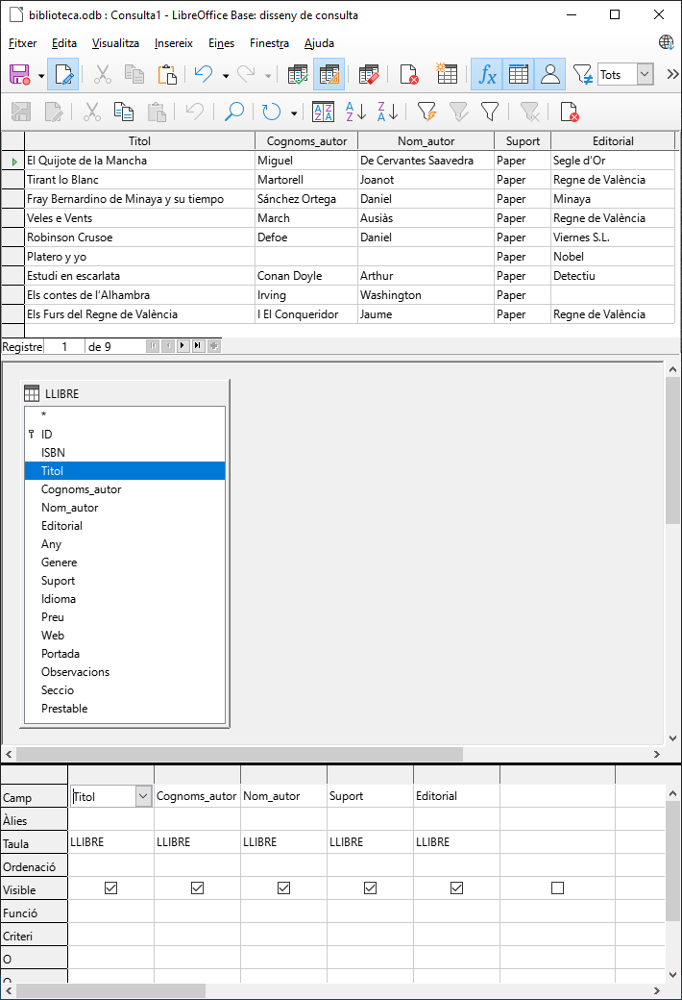

A continuació executa la consulta amb el botó `Executa la consulta (F5)`, la qual cosa farà que es mostren els resultats corresponents a aquesta.

Per a acabar, tanca la consulta sense guardar els canvis.

---

## 7.3.2. Consultes sobre diverses taules

Les taules de les bases de dades tenen relacions i, a vegades, interessa que les consultes oferisquen informació de més d'una taula.

La manera de crear la consulta en aquest cas és similar a la que acabem de veure en el punt anterior.

---

# 7.3. Criteris d'ordenació

Les consultes poden complicar-se amb la introducció d'operadors, seleccions i/o ordenacions amb la finalitat de tindre dades més filtrades i ordenats. En aquesta unitat aprendrem a crear consultes que utilitzen aquests elements que ens ajudaran a afinar en les cerques i a presentar les dades d'una manera millor a la qual havíem vist.

Els resultats de la consulta poden ser ordenats utilitzant un o diversos criteris. Veurem els passos a seguir mitjançant un exemple.

---

***Exemple pràctic: Biblioteca***

Fes clic en el botó `Consultes` de la Barra de Base de dades.
En la zona superior de Tasques, fes clic en l'opció `Crear una consulta en vista de disseny...`
Selecciona i afig la taula `LLIBRE` i `SUPORT`.
Agrega els camps `Titol`, `Cognoms_autor` i `Nom_autor` de la taula `LLIBRE`, així com el camp `Suport` de la taula `SUPORT`.
El següent pas serà fer clic sobre el desplegable `Ordenació` del camp que es vulga ordenar i seleccionar el tipus d'ordenació (ordenarem la consulta ascendentment per títol):

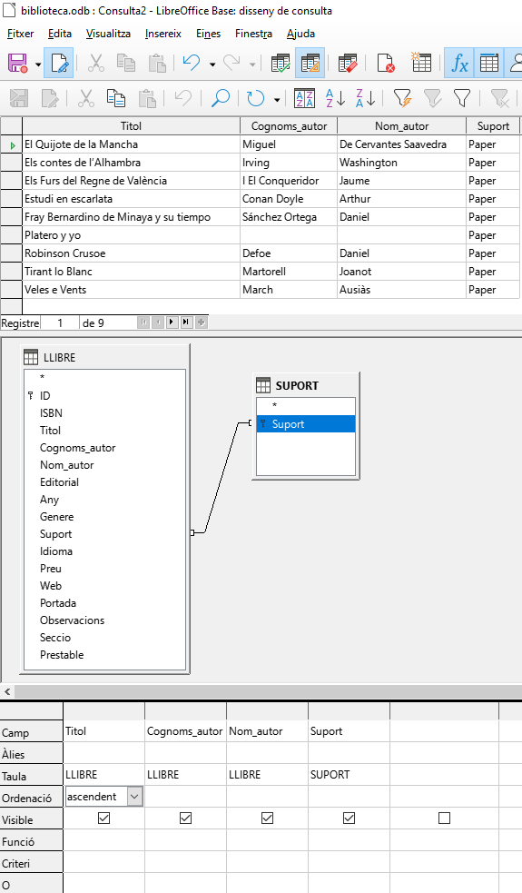

A continuació executa la consulta amb el botó `Executa la consulta (F5)`, la qual cosa farà que es mostren els resultats corresponents a aquesta.

Per a acabar, tanca la consulta sense guardar els canvis.

# 7.4. Criteris de selecció

Altra de les opcions que ens ofereix Base és la de poder seleccionar registres que complisquen una determinada condició, de manera que es mostren només aquells el valor dels quals coincidisca amb el que fixem. Per a això haurem d'inserir els criteris en la fila `Criteri` en aquelles columnes en les quals vulguem realitzar el filtre.

---

## 7.4.1. Compliment d'un criteri de selecció

***Exemple pràctic: Biblioteca***

Sobre la taula `LLIBRE` seleccionar els camps `Titol`, `Cognoms_autor` i `Nom_autor` el suport del qual siga *`Paper`*

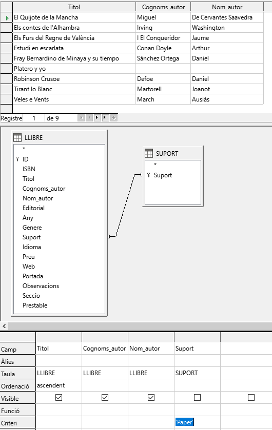

Si ens fixem, el camp `Suport` s'utilitza per a la consulta però no es mostra en executar la consulta (casella `Visible` desmarcada).

## 7.4.2 Compliment de diferents criteris simultàniament (operador I lògic) (*AND*)

També podem utilitzar múltiples criteris o filtres de selecció amb la finalitat que es complisquen varis alhora.

---

***Exemple pràctic: Biblioteca***
Sobre la taula `LLIBRE` seleccionar els camps `Titol`, `Cognoms_autor` i `Nom_autor` el suport del qual siga '*Paper*' i editorial siga '*Regne de València*'

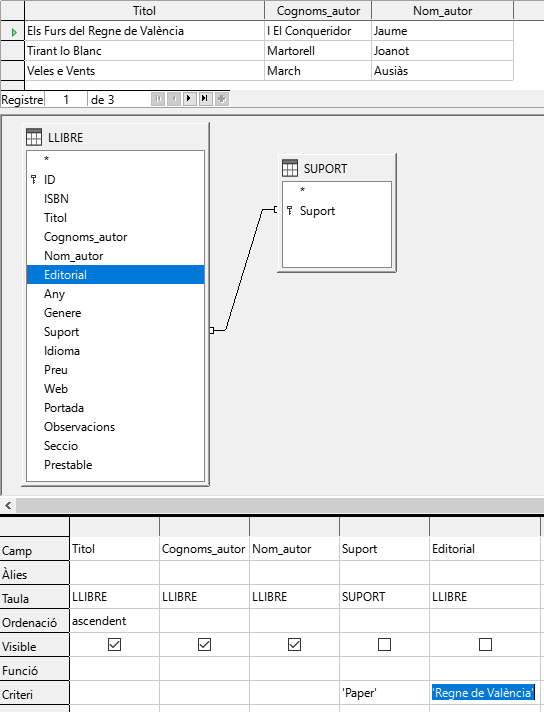

---

## 7.4.3. Compliment de, almenys, un dels criteris (operador O lògic) (*OR*)

És possible que es vulga que es complisca, almenys, algun dels criteris i que no siga necessari que es complisquen tots alhora.
Per a això utilitzarem la fila de criteri i la fila immediatament inferior (la fila `O`), de manera que se seleccionaran aquells registres que complisquen la condició de la fila criteri o de les files inferiors.

---

***Exemple pràctic: Biblioteca***

Sobre la taula `LLIBRE` seleccionar els camps `Titol`, `Cognoms_autor` i `Nom_autor` el suport del qual siga *`Paper`* o *`EBook`*

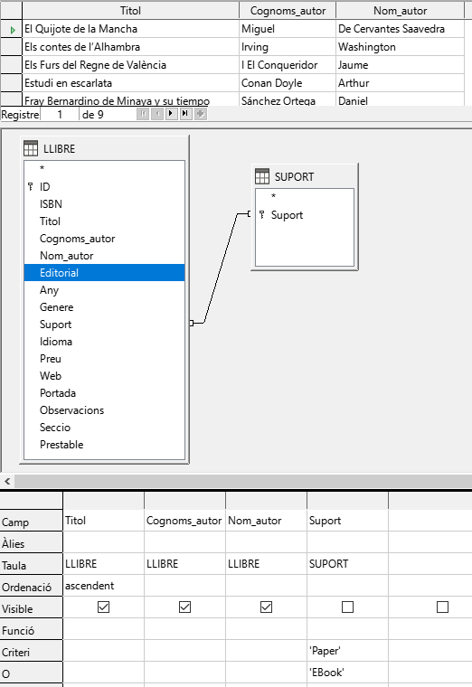

---

# 7.5. Informes

**Els informes permeten presentar en pantalla o paper les dades que estan emmagatzemats en les taules o consultes**. Encara que és possible imprimir els formularis i els fulls de dades, els informes permeten un major control sobre l'aparença final de la presentació de les dades i la possibilitat de presentar subtotals i resums de totals per categories d'informació, així com calcular el percentatge que representa cada categoria sobre el total.

*Base* utilitza *Writer* com a suport per a la generació d'informes. Això suposa un gran avantatge a l'hora de dissenyar els nostres informes per tractar-se d'una eina coneguda i de gran versatilitat.

Un informe és la manera de recuperar i presentar la informació emmagatzemada en una base de dades de manera clara i atractiva, encara que no es pot utilitzar per a modificar la informació de la taula o consulta en la qual estan basats.

Per a entendre'ns, diguem que un informe d'una base de dades es compon d'una sèrie d'apartats que permeten presentar la informació de manera ordenada facilitant la interpretació de la mateixa per part del lector. Aquest pot comptar al començament del mateix amb una capçalera en la qual s'inclou el títol d'aquest informe així com les capçaleres de les columnes que contenen la informació. Davall de les capçaleres apareixen les línies que contindran les dades que volem mostrar, és el cos de l'informe, i al final del mateix pot aparéixer el peu de l'informe en el qual es poden realitzar càlculs sobre les dades que mostra el cos de l'informe.

---

# 7.6. Crear un informe amb l'auxiliar

L'Assistent per a crear informes és l'eina que ens facilita la creació de tota mena d'informes de la manera més senzilla possible. Això no significa que aquest assistent siga l'única forma que podem utilitzar per a crear-los, però sí la més còmoda i la que recomanem. Per a això, l'assistent formula preguntes detallades sobre els orígens de registres, camps, disseny i format que desitgem i crega un informe basat en les nostres respostes.

# 📝 *Activitat 8: Consultes i informes*

**Crear consulta amb l'auxiliar**

- Obri la base de dades `Biblioteca`.
- Fes clic en el botó `Consultes` de la Barra de `Base de dades`.
- En la zona superior de `Tasques`, fes clic en l'opció `Crea una consulta utilitzant l'auxiliar...`

- A continuació es desplegarà un assistent que ens guiarà pas a pas per a crear la nostra consulta.

- **Pas 1. Selecció de camps**
  - Hem de triar quins camps volem que es mostren en la consulta.
  - En el camp `Taules`, tria la taula `LLIBRE`.
  - En `Camps disponibles`, selecciona els camps `Titol`, `Cognoms_autor`, `Nom_autor`, `Suport` i `Idioma` utilitzant els botons per a passar un a un els camps. 
  - Prem `Endavant >`.
- **Pas 2. Ordre de classificació**
  - A continuació, podem triar si volem que es mostren ordenats en funció dels valors d'un o diversos camps.
  - Selecciona que s'ordenen alfabèticament pel camp `Titol`.
  - Prem `Endavant >`.
- **Pas 3. Condicions de la busca**
  - En el següent pas podem triar si volem indicar un o diversos criteris de cerca; és a dir, si volem que les files que es mostren complisquen alguna condició en particular.
  - Com en el nostre cas l'objectiu és mostrar només els llibres en format `Paper`, hem d'indicar que per al camp `Suport` només volem aquells que continguen el valor `Paper`.
  - Prem `Endavant >`.
- **Pas 7. Àlies**
  - A continuació, podem triar amb quin nom (àlies) es visualitzaran en mostrar el resultat de la consulta, les capçaleres de les columnes dels camps que hem triat.
  - Com els noms dels camps són bastant clars, deixem les opcions per defecte.
  - Prem `Endavant >`.
- **Pas 8. Resum**
  - Per a finalitzar, se'ns mostra un resum amb totes les opcions triades i és on hem d'indicar el nom amb el qual es guardarà la consulta. A més podem triar si en finalitzar volem que es mostre el resultat de la consulta o s'òbriga la consulta en vista de Disseny per a afinar i detallar millor la consulta.
  - En el camp `Nom de la consulta` escriu `CATALOG_PAPER`. Deixem per defecte l'opció `Mostrar consulta` perquè es mostre el resultat.
  - Prem `Finalitza`.
- Una vegada acabada, s'executarà la consulta oferint una sèrie de resultats ordenats alfabèticament per títol-
- Si tanquem la consulta veurem que, en l'apartat de consultes, s'ha creat amb el nom que li hem donat.

**Crea una consulta anomenada `LLIBRE_CASTELLA` amb les següents característiques:**
  - Taula: `LLIBRE`
  - Que continga els camps `Titol`, `Cognoms_autor`, `Nom_autor`,`Idioma`, `Suport`, `Editorial` i `Any`
  - Que estiga ordenada ascendentment per `Cognoms_autor`
  - Que el camp `Idioma` siga igual a *`Espanyol`*
  - Els àlies deixa'ls com estan
  - 💾 Guarda els canvis.

**Crea una consulta anomenada `LLIBRE_BASICA` amb les següents característiques:**
  - Taula: `LLIBRE`
  - Que continga els camps `Titol`, `Cognoms_autor`, `Nom_autor`,`Idioma`, `Observacions`, `Any` i `Suport`
  - Ordena la consulta ascendentment pel camp `Titol`.
  - 💾 Guarda els canvis.

**Crear consulta amb diverses taules**

- Fes clic en el botó `Consultes` de la Barra de Base de dades.
En la zona superior de Tasques, fes clic en l'opció `Crear una consulta en vista de disseny...`
- Apareixerà el quadre de diàleg Agregar taula o consulta. Selecciona la taula `LLIBRE` i fes clic en el botó Afegir (o bé fes doble clic sobre l'objecte).
- Repeteix el procés i afig la taula `SUPORT`.
- En la finestra de disseny es mostraran totes dues taules ja relacionades automàticament, estant en disposició d'afegir els camps a la consulta.
- Selecciona els camps `ID`, `Titol`, `Cognoms_autor`, `Nom_autor`, `Suport`.
- La fila Taula conté les dues taules sobre les quals hem realitzat la consulta, és a dir, `LLIBRE` i `SUPORT`.
- Ordena la consulta ascendentment pel camp `Titol`. Guarda els canvis.
- 💾 Guarda la consulta com a `LLIBRE_RESUM`.

**Crear una consulta anomenada `INFO_PREU_ORD` amb les següents característiques:**
  - Taula: `LLIBRE`
  - Que continga els camps `Titol`, `Preu`, `Editorial`, `Any` i `Observacions`
  - Que estiga ordenada ascendentment per `Preu`
  - 💾 Guarda els canvis.

**Crear una consulta anomenada `INFO_EDITORIAL_ORD` les següents característiques:**
  - Taula: `LLIBRE`
  - Que continga els camps `Titol`, `Editorial`, `Any` i `Suport`
  - Que estiga ordenada ascendentment per `Editorial`
  - 💾 Guarda els canvis.

**Crea una consulta anomenada `LLIBRES_PAPER_MP3` amb les següents característiques:**
  - Taula: `LLIBRE`
  - Que continga els camps `Titol`, `Cognoms_autor`, `Nom_autor` i `Suport`.
  - Que el camp `Suport` siga igual a *`Paper`* o *`MP3`*.
  - 💾 Guarda els canvis.

**Crea una consulta anomenada `LLIBRES_EDREINO` amb les següents característiques:**
  - Taula: `LLIBRE`
  - Que continga els camps `Titol`, `Cognoms_autor`, `Nom_autor`, `Idioma` i `Editorial`.
  - Marca `Editorial` com **no visible**.
  - Que el camp `Editorial` siga igual a *`Regne de València`* i l'`Idioma` del qual siga *`Valencià`*.
  - 💾 Guarda els canvis.

**Crear un informe amb l'auxiliar**

- Fes clic en el botó `Informes` de la Barra de Base de dades.
En la zona superior de `Tasques`, fes clic en l'opció `Crear un informe utilitzant l'auxiliar...`
- A continuació es desplegarà un assistent que ens guiarà pas a pas per a crear la nostra consulta.
- **Pas 1. Selecció de camp**
Hem de triar quins camps volem que es mostren en l'informe i de quines taules. Les taules apareixeran en la part superior mentre que els camps es mostraran en la part inferior.
  - Selecciona la taula LLIBRE.
  - Selecciona els camps `ISBN`, `Titol`, `Cognoms_autor`, `Nom_autor`, `Suport` i `Idioma`.
  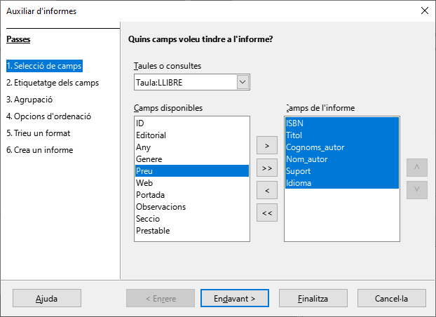
  - Prem `Endavant >`.

- **Pas 2. Etiquetar camps**
  - A continuació, podem triar amb quin nom (àlies), es mostraran les capçaleres de les columnes dels camps que hem triat en mostrar el resultat de l'informe. Per defecte l'assistent utilitzarà el nom propi de cada camp en la taula o consulta.
  - Com els noms dels camps són bastant clars, deixem les opcions per defecte.
  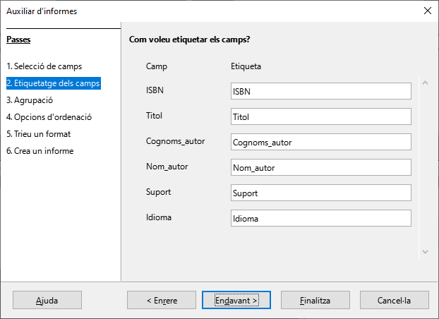
  - Prem `Endavant >`.

- **Pas 3. Agrupació**
  - Aquest pas permet triar un nivell d'agrupament de les dades, de manera que es mostre la informació resumida segons l'agrupació, podent tindre aquesta un màxim de quatre camps.
  - Per a entendre-ho millor suposem que fem una llista de llibres de tres idiomes. Aquesta llista l'organitzem en primer nivell per l'idioma i en segon nivell per l'autor. En aquest cas, l'informe crearà un primer nivell d'agrupament per a cada idioma i dins d'ell crearà un grup per a cada autor dins del qual apareixeran els llibres que ha escrit.
  - Continuarem amb l'exercici.
  - Agrupa pel camp `Idioma`.
  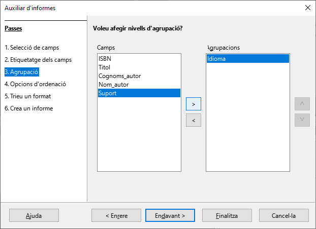
  - Prem `Endavant >`.

- **Pas 4. Opcions d'ordenació**
  - En aquest pas seleccionarem el criteri d'ordenació de camps de l'informe en funció de l'agrupament que hàgem triat. Podem ordenar per un màxim de quatre camps i en ordre ascendent o descendent. Recorda que els camps agrupats només es poden ordenar dins de cada grup.
  - Ordena els camps ascendentment per Idioma i *descendentemente per Cognoms autor.
  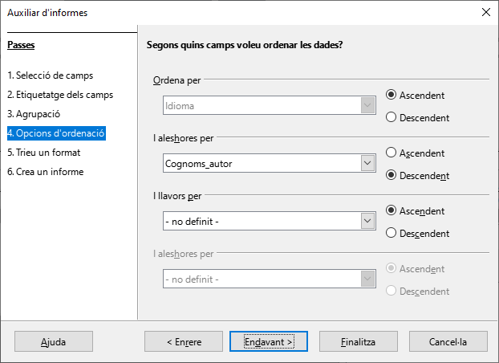
  - Prem `Endavant >`.

- **Pas 5. Triar disposició**
  - En aquest pas hem de triar l'aspecte extern de l'informe. Per a això comptem amb el quadre de llista Disseny de dades en el qual es mostra un bon nombre de plantilles predeterminades. A més, podem observar com en seleccionar qualsevol dels dissenys d'aquesta llista es reflecteix a l'instant en l'informe.
  - Una vegada decidit el disseny per a les dades, utilitzarem el quadre de llista Disseny d'encapçalats i peus de pàgina per a localitzar el model que més ens agrade per a la presentació dels peus i les capçaleres de l'informe. Igual que ocorre amb els dissenys de dades, amb els encapçalats i peus de pàgina també podem comprovar el resultat en la pàgina de l'informe.
  - L'última decisió que hem de prendre en aquest pas és l'orientació de l'informe: vertical o horitzontal. La utilització de l'una o l'altra dependrà fonamentalment de la quantitat de columnes que tinga el nostre informe.
  - Selecciona la distribució "Tabular" i orientació "Horitzontal".
  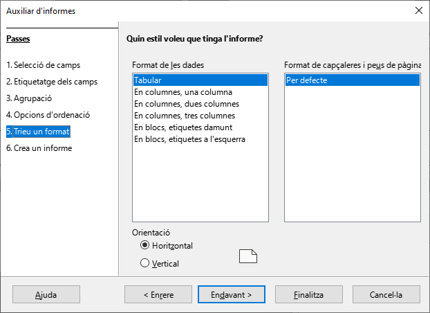
  - Prem `Endavant >`.

- **Pas 6. Crear informe**
  - Per a finalitzar, se'ns mostra un resum amb totes les opcions triades i és on hem d'indicar el nom amb el qual es guardarà l'informe. A més, podem triar si en finalitzar volem que es mostre el resultat de l'informe o s'òbriga en manera Disseny per a afinar i detallar millor l'informe.
  - Fixa el valor del camp Títol de l'informe a "INFORME_IDIOMA_AUTOR".
  - Deixa l'opció Crear informe ara perquè es mostre el resultat.
  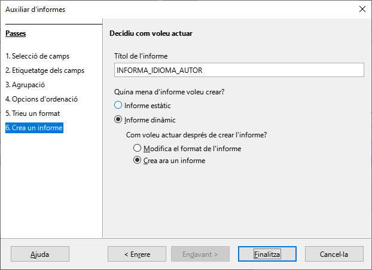
  - Prem `Finalitza`.

- A continuació s'executarà l'informe:
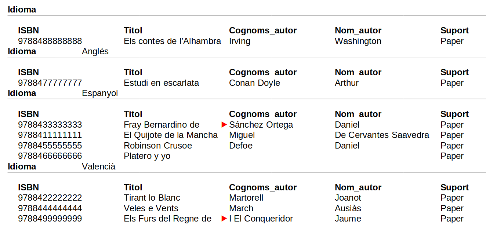
- 💾 Guarda la base de dades.
- Tanca la base de dades.
- Lliura l'activitat.