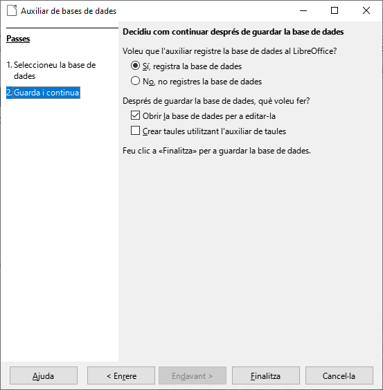

# 5. Introducció a *LibreOffice Base*
***LibreOffice Base*** és un programa de bases de dades que gestiona la creació i maneig d'aquestes, a més de possibilitar l'elaboració de formularis i informes que proporcionen als usuaris un accés fàcil a les dades. La seua interfície és senzilla, la qual cosa permet gestionar les bases de dades d'igual manera que aplicacions de característiques similars.

Base proporciona diverses característiques interessants com ara: l'habilitat d'analitzar i editar relacions a partir de la vista d'un diagrama, la incorporació de *HSQLDB com el seu motor de bases de dades relacional per defecte, la possibilitat d'utilització d'altres bases de dades en formats com *dBASE*, *MYSQL*, etc., o qualsevol base de dades compatible amb *ODBC* o *JDBC*.

A més de les característiques anteriors, *Base* inclou, igual que les altres aplicacions de la suite *LibreOffice*, multitud d'assistents i vistes per a fer el treball més fàcil als usuaris poc acostumats a aquesta mena de programes.
 	
# 6. Operacions amb bases de dades

Els sistemes gestors de bases de dades permeten realitzar un conjunt d'accions sobre les bases de dades:

- Obrir una base de dades per a gestionar-la
- Crear una nova base de dades per a emplenar-la
- Tancar una base de dades ja oberta

El SGBD Base ofereix les operacions esmentades, encara que prèviament hem d'obrir-lo. Existeixen diferents formes depenent de la configuració del sistema operatiu, si bé principalment es pot arrancar de dues diferents:

- Fent doble clic sobre un accés directe situat en l'escriptori
- Accedint al menú de LibreOffice i prement sobre LibreOffice Base

Una vegada obert podem observar l'assistent per a bases de dades en el qual es mostren diferents opcions, tant per a crear una base de dades com per a obrir/connectar-se a una ja existent.

## 6.1. Creació d'una base de dades

### 6.1.1. Pas 1: Seleccioneu la base de dades

Per a crear una nova, seleccionem la primera opció "***Crear nova base de dades***".

### 6.1.2. Pas 2: Guarda i continua
Després, fem clic en el botó *****Endavant &gt;*****, la qual cosa ens portarà a una altra pantalla amb dues opcions (que hem de deixar amb els valors per defecte).

Les opcions són les següents:

**Registrar la base de dades**. Serveix per a indicar a LibreOffice on localitzar les dades i com s'organitzen. És a dir, hem de registrar la nostra base de dades si volem que la informació que guardem siga localitzable des d'altres aplicacions. Per exemple, si en el processador de textos *Writer volem mostrar una taula amb dades guardades en la nostra base de dades, hem de registrar-la abans.

**Obrir la base de dades per a editar-la**. Tindre-la marcada perquè, si no, després de crear la base de dades es tancaria Base.

Prement el botó ***Finalitza*** s'obrirà un quadre de diàleg on hem d'indicar la carpeta en la qual s'emmagatzemarà la base de dades així com el nom amb el qual es guardarà. Per a acabar la creació premem el botó Guardar i s'obrirà la pantalla principal.

## 6.2. Obertura d'una base de dades

Per a obrir una base de dades existent seleccionarem la primera opció ***Obrir una base de dades existent***. Si hem estat treballat recentment amb l'arxiu, podem seleccionar-lo en el desplegable situat davall de l'opció anterior.

En cas contrari premerem el botó Obrir i s'obrirà un dialogue on podem seleccionar la ruta de la base de dades (fitxer amb extensió *.ODB*).
 	
# 7. Pantalla principal

Una vegada dins del programa, ens apareixerà una finestra amb l'aspecte de la figura següent (pot ser que el que veiem en l'ordinador no coincidisca exactament amb la imatge adjunta, però això és pel fet que l'aspecte del programa Base pot ser diferent per a cada usuari).

## 7.1. Barra de título
Es la barra superior de la ventana en la que se muestra el nombre de la base de datos activa. Haciendo doble clic en ella, la ventana cambiará de tamaño maximizándose o de nuevo, con otro doble clic, recuperando su tamaño original. Así podremos ampliar o disminuir rápidamente el tamaño de la ventana del programa.

## 7.2. Barra de menús
Situada bajo la barra de título, la barra de menús proporciona acceso a todas las acciones que pueden realizarse en Base, organizadas en grupos homogéneos atendiendo a funciones semejantes. Cada entrada permite acceder a las distintas funciones y para activarlas podremos usar tanto el teclado como el ratón tal y como estamos acostumbrados en otras aplicaciones de LibreOffice: en Writer, Calc o Impress, por ejemplo.

## 7.3. Barra de herramientas estándar
Situada bajo la barra de menús, ésta muestra botones que permiten acceder a las funciones más habituales de Base: abrir, guardar, copiar y pegar, acceder a la ayuda, formularios, botones específicos para tablas, ordenar, etc. Podemos ver para qué sirve cada botón gracias a los cuadros informativos que aparecen al pasar el puntero del ratón por encima de ellos y se pueden personalizar de forma que sólo estén a la vista los botones que se usen frecuentemente.

## 7.4. Panel de base de datos
En la zona de la izquierda donde se puede seleccionar el tipo de objeto de la base de datos con el que se quiere trabajar. En una base de datos de Base hay cuatro tipos principales de objetos: tablas, consultas, formularios e informes. De momento sólo te hemos hablado del primero de ellos, pero a medida que avancemos iremos viendo para qué sirve cada uno de los objetos mencionados, cómo crearlos y cómo mantenerlos.

## 7.5. Panel de tareas
En la zona central se encuentran las tareas que se pueden realizar con el tipo de objeto seleccionado. Son herramientas diferentes según cada uno de ellos. Así, por ejemplo, en el caso de la captura de pantalla siguiente, el objeto seleccionado son las Tablas y podemos ver en el panel Tareas las tareas que son posibles realizar relacionadas con este tipo de objetos.

## 7.6. Panel de objetos
En la zona inferior aparecen los objetos creados del tipo seleccionado. En la figura se puede observar que dentro del tipo tabla, todavía no tenemos ningún objeto creado.

# 8. Ayuda de Base
Dentro de la barra de menús existen diferentes posibilidades que nos brindan todas las funcionalidades del programa. El último de todos ellos se llama Ayuda y en él aparecen las distintas opciones de ayuda de LibreOffice. Entre todas las opciones disponibles destacan dos:

Por un lado la opción Ayuda de LibreOffice que contiene una ayuda bastante extensa de todas las herramientas de LibreOffice clasificada por contenidos y con la opción incluida de buscar ayuda recorriendo el índice de contenidos o en función de una palabra clave.
Y, por otro lado, la opción ¿Qué es esto?, que permite que se muestre una pequeña información sobre el objeto en el que tengamos situado el cursor.
Nos centraremos en la primera de las opciones: Ayuda de LibreOffice, la cual mostrará, al ser pulsada, una ventana como la de la figura:
 	 
Ejercicios	
Ejercicio
 	
Cerrar la base de datos

Cierra la base de datos "biblioteca". Ve al menú Archivo → Cerrar.
 	 
 	
IMPORTANTE
 	 
Ojo	
En las prácticas siguientes vamos a trabajar sobre la misma base de datos "biblioteca". Cuando terminemos las prácticas de formularios, subiremos el archivo.
