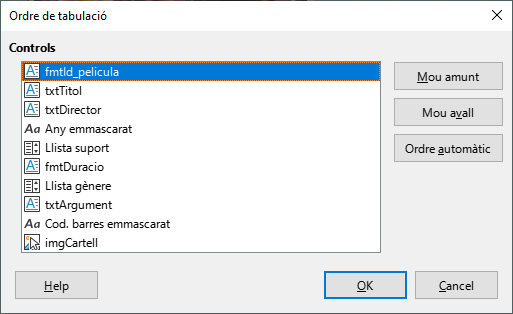
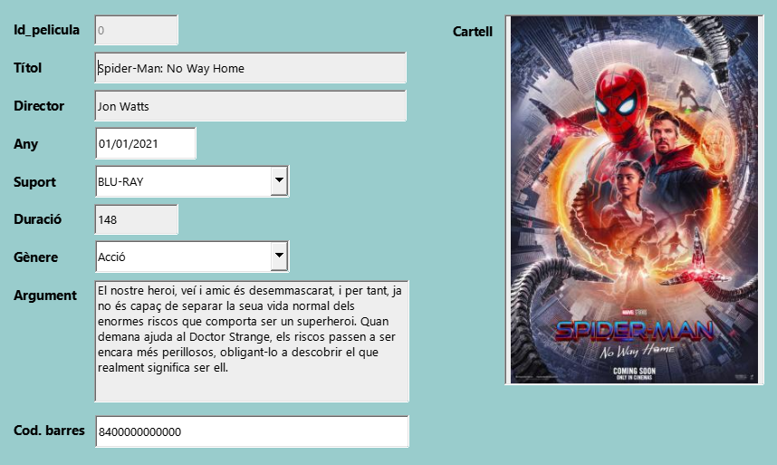

UD11: Bases de dades (II)

# 1. *LibreOffice Base*: Formularis. Llistes de dades, formats, màscares i disseny

## 🎯 Objectius

- Conéixer les llistes de dades.
- Crear i utilitzar llistes de dades.
- Conéixer i aplicar camps amb format i màscares en formularis.
- Millorar la presentació i disseny de formularis.

---

# 1.1 Llistes de dades

Si ens fixem en la base de dades del videoclub, podem veure que s'està repetint el mateix valor moltes vegades: per exemple, *`Històric`* apareix en diverses files. És a dir, en introduir el mateix valor de manera redundant s'està possibilitant que en algun moment l'escriguem malament, per exemple, *`Històric`*, i tinguem un nou gènere que no correspon a cap pel·lícula, ja que ni tan sols existeix.

Pot ocórrer també que tots els crítics de cinema es posen d'acord i decidisquen que el gènere *`Històric`* no té un nom adequat i que és més adequat anomenar-lo *`Històries`*. Llavors, en la taula `PELICULA`, s'ha d'anar una a una canviant el nom i amb cura de no equivocar-se en teclejar. Potser si tenim quatre pel·lícules d'aquest gènere no ens semble un gran problema fer aquest canvi quatre vegades però si resulta que es té en la col·lecció tres-centes pel·lícules d'aquest gènere pot ser que el problema semble més important.

La solució als problemes anteriors està a separar la informació que apareix repetida contínuament en una nova taula GENERE i indicar d'alguna forma en la nostra base de dades que hi ha files de la taula `PELICULA` i de la taula `GENERE` que estan relacionades.

---

# 1.2 Camps patró. Màscares

La màscara d'edició és una plantilla especial que determina la manera en què s'introduiran les dades en un camp de tipus Text o Data/Hora. Els caràcters per a definir una màscara es mostren en la següent taula:

Caràcter | Significat
-|-
**L** | Una constant de text. Aquesta posició no es pot editar. El caràcter es mostra en la posició corresponent de la màscara literal.
**a** | Es poden introduir els caràcters `a-z` i `A-Z`. Els caràcters en majúscules no es converteixen a caràcters en minúscules.
**A** | Es poden introduir els caràcters `A-Z`. Si s'introdueix una lletra minúscula, es converteix automàticament a una lletra majúscula.
**c** | Es poden introduir els caràcters `a-z`, `A-Z` i `0-9`. Els caràcters en majúscules no es converteixen a caràcters en minúscules.
**C** | Es poden introduir els caràcters `A-Z` i `0-9`. Si s'introdueix una lletra minúscula, es converteix automàticament a una lletra majúscula.
**N** | Només es poden introduir els caràcters numèrics `0-9`.
**x** | Es poden introduir tots els caràcters imprimibles.
**X** | Es poden introduir tots els caràcters imprimibles. Si s'utilitza una lletra minúscula, es converteix automàticament a una lletra majúscula.

---

# 1.3 Ordre de tabulació

Quan creguem un formulari, s'estableix per defecte un ordre de tabulació per als camps, és a dir, l'ordre en el qual va passant el tabulador d'un camp a un altre. Quan efectuem canvis afegint, modificant o esborrant camps, l'ordre de tabulació s'altera i queda desordenat.

Base ens permet tornar a establir l'ordre de tabulació que desitgem, de manera que anem passant de camp a camp segons l'ordre de pantalla.

---

# 📝 *Activitat 1: Base de dades: Videoclub*

Crearem una base de dades buida que utilitzarem en les següents activitats.

- Crea una nova base de dades buida amb les opcions per defecte: que s'òbriga per a editar-la en finalitzar la creació i que quede registrada.
- Guarda la base de dades amb el nom *`Videoclub`*.

## Crear taula `PELICULA`

Introduirem els camps que s'indiquen a continuació:

Camp | Tipus | Longitud | Descripció
-|-|-|-
Id_pelicula | Enterr [`INTEGER`] | *Per defecte* | Identificador (clau primària)
Titol | Text [`VARCHAR`] | 50 | Títol
Director | Text [`VARCHAR`] | 35 | Director
Any | Data [`DATE`] | *Per defecte* | Any de producció
Suport | Text [`VARCHAR`] | 20 | Tipus de suport en el qual es troba emmagatzemada (DVD, Blu-ray, MP4, VHS, etc.)
Duracio | Enter [`INTEGER`] | *Per defecte* | Temps de duració en minuts
Genere | Text [`VARCHAR`] | 20 | Gènere al qual pertany la pel·lícula
Argument | Nota [`LONGVARCHAR`] |*Per defecte* | Argument
Cartell | Imatge [`LONGVARBINARY`] | *Per defecte* |Foto del cartell
CodEAN | Text [`VARCHAR`] | 13 | Codi de barres (EAN)

- Clau principal `Id_pelicula`:
  - Estableix el camp `Id_pelicula` com a **clau principal**.
  - Fixa el valor de la propietat `Valor Automàtic` a *`Sí`*.

- Valors per defecte:
  - `Titol`: *Sense títol*
  - `Director`: *Desconegut*
  - `Suport`: *DVD*
  - `Duracio`: *0*
  - `Genere`: *Sense gènere*
  - `Argument`: *No conegut*

- Entrada requerida:
  - `Titol`
  - `Director`
  - `Any`

- Format del camp:
  - `Any`: DD/MM/AAAA (*en anglés DD/MM/YYYY*)
  - `Duracio`: ##,##

- 💾 Guarda la taula.

## Introducció de dades

| Id_pelicula  | Titol  | Director  | Any  | Suport  | Duracio  | Genere  | Argument  | Cartell  | CodEAN  |
|--- |--- |--- |--- |--- |--- |--- |--- |--- |--- |
| 0  | Spider-Man: No Way Home  | Jon Watts  | 01/01/2021  | Blu-Ray  | 148  | Acció  | El nostre heroi, veí i amic és desemmascarat, i per tant, ja no és capaç de separar la seua vida normal dels enormes riscos que comporta ser un superheroi. Quan demana ajuda al Doctor Strange, els riscos passen a ser encara més perillosos, obligant-lo a descobrir el que realment significa ser ell.  | `<OBJECT>`  | 8400000000000  |
| 1  | El padrino  | Francis Ford Coppola  | 01/01/1972  | VHS  | 175  | Drama  | Amèrica, anys 40. Do Vito Corleone és el respectat i temut cap d'una de les cinc famílies de la màfia de Nova York. Té quatre fills: Connie, l'impulsiu Sonny , el pusil·lànime Fredo i Michael, que no vol saber res dels negocis del seu pare. Quan Corleone, en contra dels consells de 'Il consigliere' Tom Hagen, es nega a participar en el negoci de les drogues, el cap d'una altra banda ordena el seu assassinat. Comença llavors una violenta i cruenta guerra entre les famílies mafioses.  | `<OBJECT>`  | 8411111111111  |
| 2  | Cadena perpetua  | Frank Darabont  | 01/01/1994  | DVD  | 142  | Drama  | Acusat de l'assassinat de la seua dona, Andrew Dufresne, després de ser condemnat a cadena perpètua, és enviat a la presó de Shawshank. Amb el pas dels anys aconseguirà guanyar-se la confiança del director del centre i el respecte dels seus companys de presó, especialment de Xarxa, el cap de la màfia dels suborns.  | `<OBJECT>`  | 8422222222222  |
| 3  | Pulp Fiction  | Quentin Tarantino  | 01/01/1994  | DVD  | 153  | Thriller  | Jules i Vincent, dos assassins a sou amb no massa llums, treballen per al gàngster Marsellus Wallace. Vincent li confessa a Jules que Marsellus li ha demanat que cuide de Mia, la seua atractiva dona. Jules li recomana prudència perquè és molt perillós sobrepassar-se amb la núvia del cap. Quan arriba l'hora de treballar, tots dos han de posar-se "mans a l'obra". La seua missió: recuperar un misteriós maletí.  | `<OBJECT>`  | 8433333333333  |
| 4  | El milagro de P. Tinto  | Javier Fesser  | 01/01/1998  | DVD  | 104  | Comèdia  | En la seua més tendra infància, el xiquet P. Negre té una revelació: el seu propòsit ha de ser la procreació. 15 anys després, P. Negre i Olivia formen una llar al qual no arriben xiquets. 50 anys després, acullen a dos marcians.  | `<OBJECT>`  | 8444444444444  |
| 5  | Campeones  | Javier Fesser  | 01/01/2018  | Blu-Ray  | 124  | Comèdia  | El segon entrenador d'un equip de bàsquet, després d'una baralla amb el primer entrenador i un accident de cotxe, és obligat a complir 90 dies de treballs socials entrenant a un equip de persones amb discapacitat intel·lectual.  | `<OBJECT>`  | 8455555555555  |

## Formulari `FPELICULA`

- Crea un formulari utilitzant l'auxiliar que continga tots els camps de la taula `PELICULA`.
- Tria la disposició `En columnes - Etiquetes a l'esquerra`.
- Guarda el formulari amb el nom `FPELICULA`.

## Introducció de cartells

- Per a cadascun dels registres de la taula `PELICULA`, descàrrega d'Internet una imatge del cartell i afig aquesta imatge en el camp `Cartell`.
- ***Procura que les fotos no ocupen molt espai***.

## Disseny del formulary

- Camp `Cartell`:
  - El cartell de les pel·lícules es mostra xicotet i no es pot apreciar bé.
  - Fes clic en el camp `Cartell`. Mou-lo a la dreta del formulari. Fes-lo més gran.

- Camp `Argument`
  - Encara que en principi es mostra bé l'argument, ens assegurarem.
  - Canvia la propietat `Alineació vert` al valor *`Superior`*.
  - Canvia la propietat `Divisió de paraules` al valor *`Sí`*.

## Llista de dades

### Taula `GENERE`. Edició

- Crearem una nova taula `GENERE` que continga tots els gèneres de cinema.
- Introdueix els camps que s'indiquen a continuació:

Camp | Tipus | Longitud | Descripció
-|-|-|-
Genere | Text [`VARCHAR`] | 20 | Gènere de cinema (clau primària)

- Marca el camp `Genere` com a *`Clau primària`*

### Taula `GENERE`. Entrada de dades

- Introdueix diversos registres amb els diferents tipus de gènere:

| Genere  |
|--- |
| Acció  |
| Aventures  |
| Bèl·lic  |
| Ciència-ficció  |
| Comèdia  |
| Documental  |
| Drama  |
| Històric  |
| Terror  |
| Thriller  |

### Formulari `FPELICULA`. Crear llista de gèneres

Ara modificarem el formulari perquè el camp gènere siga una llista desplegable amb els valors que hem introduït anteriorment.

- Obri el formulari en vista disseny.
- Prem sobre la icona de la barra lateral esquerra anomenada `Quadre de llista`.
- Dibuixa el nou control a la dreta del camp gènere.
- Apareixerà l'assistent per a guiar-nos en el procés. Seguim els passos corresponents:
  - Tria la taula GENERE.
  - `Endavant >`
  - Selecciona el camp `Genere`.
  - `Endavant >`
  - Tria el camp `Genere` tant en la llista de l'esquerra com en la dreta.
  - `Finalitza`
- Suprimeix l'anterior camp d'entrada de `Genere` i deixa el nou quadre de llista.

### Taula `SUPORT`. Edició

- Crearem una nova taula `SUPORT`.
- Introdueix els camps que s'indiquen a continuació:

Camp | Tipus | Longitud | Descripció
-|-|-|-
Suport | Text [`VARCHAR`] | 20 | Tipus de suport en el qual es graven les pel·lícules (clau primària)

- Marca el camp `Suport` com a *`Clau primària`*

### Taula `SUPORT`. Entrada de dades

- Introdueix diversos registres amb els diferents tipus de gènere:

| Suport  |
|--- |
| BLU-RAY  |
| DVD  |
| SD  |
| USB  |
| VHS  |

### Formulari `FPELICULA`. Crear llista de suports

- Repeteix el mateix procés que has realitzat per al camp `Genere`, però aquesta vegada sobre el camp `Suport`. Modifica el necessari en el formulari.

## Aplicar màscara. Camp `CodEAN`

- Obri el formulari en vista disseny.
- Prem sobre la icona de les fletxes de la barra lateral esquerra i en `Més controls`.
- Prem en la icona `Camp emmascarat` (o *de patró*).
- Dibuixa el camp en el formulari al costat del camp `CodEAN`.
- Fes doble clic sobre el camp. En la pestanya **General**, en la propietat `Nom` escriu *`Cod. barres emmascarat`*.
- Tria la propietat `Edita la màscara`. Escriu la màscara *`NNNNNNNNNNNNN`* per a mostrar el format estàndard de codi de barres amb 13 números.
- En la propietat `Màscara literal` escriu també *`NNNNNNNNNNNNN`*.
  - Els camps patró consten d'una màscara d'entrada i d'una màscara de caràcters.
  - La màscara d'entrada determina quines dades es poden introduir.
  - La màscara de caràcters determina els continguts del camp patró quan es carrega el formulari.
- En la propietat `Vora` posa el valor *`Vista en 3D`*.
- Selecciona la pestanya `Dades`. Desplega la llista i tria el camp `CodEAN`.
- Suprimeix l'anterior camp d'entrada de `CodEAN` i deixa el nou camp emmascarat.

## Aplicar màscara. Camp `Any`

- Afig un nou `Camp emmascarat` (o *de patró*).
- Dibuixa el camp en el formulari al costat del camp `Any`.
- Fes doble clic sobre el camp. En la pestanya **General**, en la propietat `Nom` escriu *`Any emmascarat`*.
- Tria la propietat `Edita la màscara`. Escriu la màscara *`LLLLLLNNNN`* per a mostrar el format estàndard de codi de barres amb 13 números.
- En la propietat `Màscara literal` escriu *`01/01/____`*.
- Suprimeix l'anterior camp d'entrada de `Any` i deixa el nou camp emmascarat.

## Ordre de tabulació

- Obri el formulari en vista disseny.
- En la barra d'eines inferior, fes clic en la icona `Ordre d'activació`.
- Mou els diferents camps perquè quede l'ordre correcte:

- 💾 Guarda els canvis i tanca el formulari.
- Fes doble clic en el formulari. Comprova que ara està correcte l'ordre de tabulació. Per a això, passa amb la tecla tabulador d'un camp a un altre.

- Tanca el formulari.
- 💾 Guarda els canvis en la base de dades.
- Tanca la base de dades "Videoclub".
