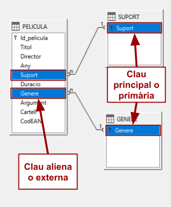
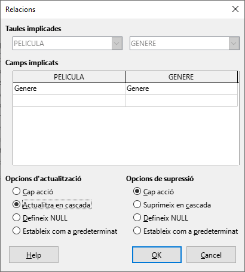

UD12: Bases de dades (II)

# 2. *LibreOffice Base*: Relacions. Integritat referencial. Accions en cascada

## 🎯 Objectius

- Repassar el concepte de relació i de clau aliena.
- Repassar el concepte d'integritat referencial.
- Entendre el concepte d'accions en cascada.
- Utilitzar operacions en cascada.

---

# 2.1 Relacions entre taules

Les taules no són elements aïllats, sinó que solen estar relacionades entre si. Per a això s'utilitzen camps com a enllaços i es defineixen un tipus de claus anomenades alienes. En aquesta unitat repassarem els conceptes de relació i de clau aliena, així com la creació i utilització de relacions entre diferents tipus de taules.

Després de crear taules diferents en la base de dades, necessitem una manera d'indicar-li a *Base* com ha de tornar a combinar aqueixa informació.

El primer pas d'aquest procés és **definir relacions entre les taules**. Una vegada realitzada aquesta operació, podem crear consultes, formularis i informes per a mostrar informació de diverses taules alhora.

**Una relació fa coincidir les dades dels camps clau** (normalment un camp amb el mateix nom en totes dues taules). En la majoria dels casos, aquests camps coincidents són la clau principal d'una taula, que proporciona un identificador únic per a cada registre, i una clau externa de l'altra taula.

Les relacions poden ser, principalment, de tres tipus:

## Un a molts `(1:N)`

Aquest tipus es dona quan una fila de la primera taula pot estar relacionada amb moltes files de la segona taula, però una fila de la segona només està relacionada amb una de la primera.
*Per exemple, una persona pot tindre molts telèfons (fix, mòbil) però, donat un telèfon en particular, només pertany a una persona.*

## Un a un `(1:1)`

Aquest tipus de relació apareix amb menys freqüència i succeeix quan una fila de la primera taula només pot estar relacionada amb una fila de la segona i una fila de la segona taula només pot estar relacionada amb una de la primera.
*Per exemple, donada una persona casada, només està casada amb una altra persona.*

## Molts a molts `(N:N)`

Aquesta classe de relació ocorre quan una fila de la primera taula pot estar relacionada amb moltes files de la segona taula i una fila de la segona taula pot estar-ho amb moltes files de la primera.
*Per exemple, un comercial pot vendre molts productes i, donat un producte, pot ser venut per molts comercials.*

---

# 2.2 Normes a tindre en compte en les relacions

A l'hora d'implementar les relacions en Base cal tindre en compte una sèrie de normes importants:

- En primer lloc, **tancar totes les taules que estiguen obertes**. No és possible crear ni modificar relacions entre taules obertes.
- Donades 2 taules, sempre es relacionaran per un **camp en comú**. Lògicament, aquest camp haurà de ser del **mateix tipus i grandària** en totes dues taules.
- Les 2 taules a relacionar hauran de contindre sempre una **clau principal** o índex únic. En cas contrari, *Base* ens avisarà i no ens deixarà crear la relació.
- Si en arrossegar els camps, no se'ns permet crear la relació, obligatòriament haurem de corregir la informació de la base de dades, ja que existirà algun tipus d'inconsistència.
- Perquè una relació estiga correctament creada, Base ha d'indicar la **cardinalitat** de la relació: `1 → 1`, `1 → n`, `n → n`.
- Al final del procés de disseny, totes les taules d'una base de dades han d'estar relacionades almenys amb una altra taula. En cas de tindre una taula sense relacionar amb cap altra, no tindrà cap utilitat. Per tant, o sobra la taula o està mal dissenyada la base de dades.

---

# 2.3 Integritat referencial

En la relació que hem definit en l'apartat anterior, s'impedeix que qualsevol registre relacionat siga modificat o eliminat. Aquesta propietat és el que es coneix com a integritat referencial.

Quan existeix una relació entre 2 taules, qualsevol operació amb les dades ha de respectar la relació. En cas contrari, no es realitzarà.

La integritat referencial és una restricció que es defineix sobre una relació i que, en *Base*, tota relació porta implícita a causa del concepte de clau aliena.

La **integritat referencial**, per tant, **és un mecanisme que ens permet assegurar que els valors que estem introduint són íntegres i coherents amb els valors que ja existeixen**.

---

# 2.4 Accions en cascada

En la integritat referencial de la unitat anterior vam veure que l'intent de realitzar determinades operacions sobre una de les taules comportava la impossibilitat d'aquestes, llevat que férem determinades modificacions. Això es produeix a causa d'un element com són les accions en cascada, per a evitar els problemes derivats dels canvis produïts en taules relacionades.

En la relació que definim en la unitat anterior s'impedia que qualsevol registre relacionat fora modificat o eliminat. Aquesta propietat és el que es coneix com a integritat referencial. És a dir, si intentem esborrar una activitat que tinga socis relacionades, *Base* ens ho impedirà. D'idèntica forma, si modifiquem una activitat que tinga socis, també relacionades, *Base* ens ho impedirà.
No obstant això, és possible modificar el comportament de les relacions perquè es permeten determinades opcions tant per als esborrats com per a les actualitzacions. És a dir, la relació establida entre dues taules implica que qualsevol modificació realitzada sobre la informació que conté la taula primària afectarà les dades de la taula secundària.

---

## 2.4.1 Opcions d'actualització

Tenim 4 opcions:

- **Cap acció**. És l'opció per defecte. Indica que els canvis realitzats a una clau primària no afectaran altres camps de clau aliena.
- **Actualitza en cascada**. Actualitza tots els camps de clau aliena si es modifica el valor de la clau primària corresponent. És l'opció més segura i conservadora de les possibles i la que s'ha d'utilitzar en la majoria dels casos.
- **Defineix *NULL***. Si es modifica la clau primària corresponent, aquesta opció estableix el valor *"NULL"* (valor buit) per a tots els camps de clau aliena.
- **Estableix com a predeterminat**. Si es modifica la clau primària corresponent, aquesta opció estableix un valor per defecte per a tots els camps de clau aliena.

---

## 2.4.2 Opcions d'eliminació

Tenim 4 opcions:

- **Cap acció**. És l'opció per defecte. Indica que la supressió d'una clau primària no tindrà efecte en altres camps de clau aliena.
- **Suprimeix en cascada**. Indica que si se suprimeix un camp de clau primària se suprimiran tots els camps de clau aliena corresponents.
- **Defineix *NULL***. Si se suprimeix la clau primària corresponent, s'assignarà el valor *"NULL"* a tots els camps de clau aliena.
- **Estableix com a predeterminat**. Si se suprimeix la clau primària corresponent, es definirà un valor per defecte per a tots els camps de clau aliena.

---

# 📝 *Activitat 2: Relacions i accions en cascada*

## Crear relacions. `PELICULA` i `GENERE`

- Tanca totes les taules obertes. No és possible establir relacions entre taules obertes, ja que estem introduint dades.
- Ve al menú `Eines` → `Relacions...` Fes clic en la icona `Afig taules`.
- Selecciona les taules `PELICULA` i `GENERE` amb el botó `Afig` o fent doble click.

En el nostre cas, en la taula `PELICULA` tenim un camp `Genere` que fa referència al gènere de cinema al qual pertany la pel·lícula. Per tant, la columna ha de ser de la mateixa mena de dades que la columna que siga clau primària en l'altra taula i els valors que podrà contindre serà qualsevol dels valors que prenga la clau primària en aquesta taula. En definitiva, en la taula `PELICULA` el camp `Genere` ha de ser de la mateix tipus de dades que el camp de la taula `GENERE`.

Ara falta indicar-li a *Base* explícitament que les dues taules estan relacionades i que utilitzarem per a mantindre aquesta relació la columna `Genere` de la taula `PELICULA`.

- Arrossega del camp `Genere` de `PELICULA` al camp `Genere` de `GENERE`. *Base* crea una relació **un a molts** entre les 2 taules.

## Crear relacions. `PELICULA` i `SUPORT`

- Tanca totes les taules obertes. No és possible establir relacions entre taules obertes.
- Estableix una relació entre el camp `Suport` de `PELICULA` i el camp `Suport` de `SUPORT`.

## Actualització en cascada

Modificar la relació existent entre les taules `PELICULA` i `GENERE` per a permetre l'actulització en cascada.

- Ve al menú `Eines` → `Relacions`.
- Fes **doble clic** en la **línia de la relació** entre les taules `PELICULA` i `GENERE`.

- En `Opcions d'actualització`, marca l'opció `Actualitza en cascada`.

- Prem el botó `OK`.
- Tanca la pantalla de relacions.

## Modificar dades en cascada

- Ve a la taula `GENERE`.
- Modifica el valor *`Comèdia`* per *`Humor`*.
- Guarda els canvis
- Ve a la taula `PELICULA` i comprova que tots els registres relacionats han sigut actualitzats en cascada.

## Eliminació en cascada

Modificarem la relació existent entre les taules *PELICULA i GENERE per a permetre l'eliminació en cascada.

- Ve al menú `Eines` → `Relacions`.
- Fes doble clic en la primera línia de la relació entre les taules `PELICULA` i `GENERE`.

- En Opcions de supressió, marca l'opció `Defineix NULL`.

## Eliminar dades en cascada

- Ve a la taula `GENERE`.
- Elimina el valor *`Thriller`*.
- Guarda els canvis
- Ve a la taula `PELICULA` i comprova que els registres relacionats han sigut actualitzats en cascada.

---

- 💾 Guarda els canvis en la base de dades.
- Tanca la base de dades.
