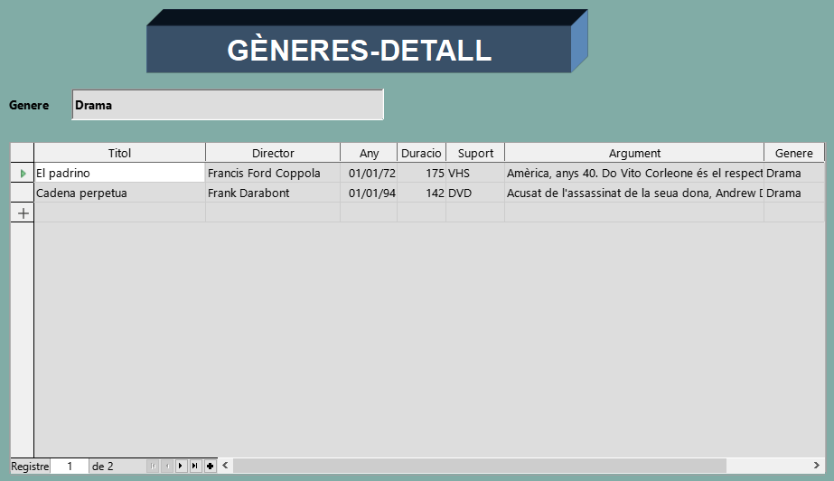
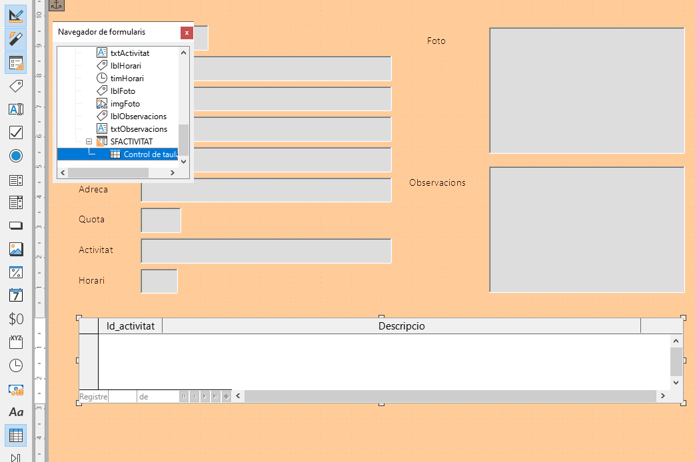
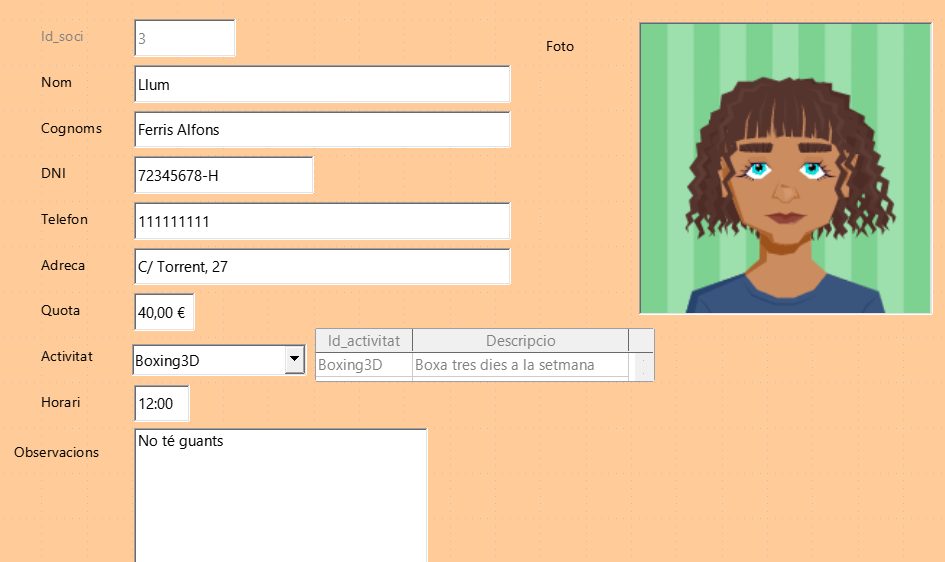

UD12: Bases de dades (II)

# 5. *LibreOffice Base*: Formularis mestre-detall/subformularis

## 🎯 Objectius

- Concepte de formulari mestre-detall o subformulari.
- Crear i utilitzar subformularis.

---

# 5.1. Formularis mestre-detall/subformularis

Els formularis mestre-detall o subformularis representen formularis que es troben localitzats dins d'altres formularis. Serveixen per a mostrar informació contextual o addicional d'un o més camps del formulari.

En pràctiques anteriors, ens havíem saltat el pas d'afegir subformularis. Ara ha arribat el moment d'utilitzar aquest pas per a crear nostres subformularis.

---

# 📝 *Activitat 5: Subformularis*

## Base de dades `Videoclub`

Crearem un formulari fent que, cada vegada que ens movem entre els diferents registres, ens mostre la informació de totes les pel·lícules pertanyents a aqueix gènere. Per a això, utilitzarem subformularis.

### Crear subformulario

- Obri la base de dades `Videoclub`.
- Fes clic en el botó `Formularis` de la Barra de dades.
- En la zona superior de `Tasques`, fes clic en l'opció `Crear un formulari utilitzant l'auxiliar...`

#### Pas 1. Selecció de camps

Hem de triar quins camps volem que es mostren en el formulari.

- Tria la taula `GENERE`.
- Selecciona tots els camps.
- Prem `Endavant >`.

#### Pas 2. Configurar un subformulari

Crearem un subformulari basant-nos en la relació existent entre la taula `GENERE` i `PELICULA`, un gènere té moltes pel·lícules i una pel·lícula pertany a un només gènere.

- Marca la casella `Afig un subformulari`.
- Marca l'opció `Subformulari basat en relació existent`.
- En l'opció `Quina relació voleu afegir?` fes clic sobre la taula `PELICULA`.
- Prem `Endavant >`.

#### Pas 3. Afegir camps de subformulari

Hem d'afegir els camps a mostrar en el subformulari.

- Selecciona els camps `Titol`, `Director`, `Any`, `Duracio`, `Suport`, `Argument` i `Genere`.
- Prem `Endavant >`.

#### Pas 5. Organitzeu els controls

En el següent pas podem triar la distribució dels camps en el formulari.

- En `Disposició del formulari principal` fes clic en la icona de l'esquerra `En columnes - Etiquetes a l'esquerra`.
- Prem `Endavant >`.

#### Pas 6. Especifiqueu l'entrada de dades

- Deixem les opcions per defecte.
- Prem `Endavant >`.

#### Pas 7. Aplica els estils

Ací triarem un dels estils proposats per *Base*.

- Tria el color i efectes 2D o 3D que vulgues.
- Prem `Endavant >`.

#### Pas 8. Especifiqueu el nom

Finalment guardem el formulari.

- En el camp `Nom del formulari` escriu *`SFGENERE`*. Resta d'opcions per defecte.
- Fes clic a `Finalitza`.

Una vegada finalitzat l'assistent, se'ns obri el formulari per a manipular dades. Si ens fixem, cada vegada que canviem de gènere, les dades del subformulari canvien automàticament, mostrant informació detallada de les pel·lícules que pertanyen a aquest gènere.

### Personalitzar formulari

- Ve al formulari `SFGENERE`.
- Obri el formulari en mavista de disseny (edita).
- Pot utilitzar-se els efectes i colors que es desitge.
- Canvia el color de fons.
- Redimensiona els elements de la pantalla.
- Inserta un rectangle arredonit 3D. Escriu dins el text *`GÈNERES-DETALL`*.
Per exemple:

- 💾 Guarda els canvis.
- Tanca el formulari.

## Base de dades: `Gimnàs`

Farem encara més intuïtiu el formulari FSOCI fent que, cada vegada que ens movem entre els diferents registres, ens mostre la descripció de l'activitat que realitza cada soci. Per a això, utilitzarem subformularis.

### Crear consulta

En primer lloc, necessitem crear una consulta que posteriorment usarem en el nostre subformulari.

- Obri la base de dades `Gimnàs`.
- Crea una consulta en vista de disseny amb nom *`CSF_activitat`*.
- Tria la taula `ACTIVITAT` i selecciona els camps `Id_activitat` i `Descripcio`.
- 💾 Guarda els canvis.
- Tanca la consulta.

### Crear subformulari

- Fes clic en el botó `Formularis` de la `Barra de dades`.
- En la zona superior de `Tasques`, fes clic en l'opció `Crear un formulari utilitzant l'auxiliar...`

#### Pas 1. Selecció de camps

Hem de triar quins camps volem que es mostren en el formulari.

- Tria la taula `SOCI`.
- Selecciona tots els camps.
- Prem `Endavant >`.

#### Pas 2. Configurar un subformulari

Crearem un subformulari basant-nos en la relació existent entre la taula `SOCI` i `ACTIVITAT`.

- Marca la casella `Afig un subformulari`.
- Marca l'opció `Subformulari basat en selecció manual dels camps`.
- Prem `Endavant >`.

#### Pas 3. Afegiu camps de subformulari

Hem d'afegir els camps a mostrar en el subformulari.

- Tria la consulta `CSF_ACTIVITAT` i selecciona els 2 camps d'aquesta consulta.
- Prem `Endavant >`.

#### Pas 4. Recupereu els camps units

En aquest pas es defineix la relació existent entre el subformulari i el formulari principal.

- En `Primer camp de subformulari`, selecciona el camp `Id_activitat`.
- En `Primer camp unit de formulari principal`, selecciona el camp `Activitat`.
- Prem `Endavant >`.

#### Pas 5. Organitzeu els controls

En el següent pas podem triar la distribució dels camps en el formulari.

- Fes clic en la icona de l'esquerra `En columnes - Etiquetes a l'esquerra`.
- Prem `Endavant >`.

#### Pas 6. Especifiqueu l'entrada de dades

- Deixem les opcions per defecte.
- Prem `Endavant >`.

#### Pas 7. Aplicar els estils

Ací triarem un dels estils proposats per Base.

- Tria el color i efectes 2D o 3D que vulgues.
- Prem `Endavant >`.

#### Pas 8. Especifique el nom

Finalment guardem el formulari.

- En el camp `Nom del formulari` escriu `SFSOCI`. Resta d'opcions per defecte.
- Fes clic a `Finalitza`.

Una vegada finalitzat l'assistent, se'ns obri el formulari per a manipular dades. Si ens fixem, cada vegada que canviem de soci, les dades del subformulari canvien automàticament, mostrant la descripció de l'activitat que realitza el soci actual.

- 💾 Guarda els canvis.
- Tanca el formulari.

> ⚠ Com podem observar, s'han perdut tots els canvis que havíem fet en el nostre formulari `FSOCI`, ja que ens faltaria incloure la llista desplegable d'activitats i el camp DNI amb màscara d'edició de dades. A més, també s'han perdut els canvis en el disseny com el color, etc.

## Subformularis en vista de diseny

L'assistent és una forma ràpida de crear subformularis però té l'inconvenient que perdem tots els canvis efectuats en el formulari principal.

Existeix un **mètode alternatiu** per a incloure subformularis sense necessitat de perdre les modificacions realitzades sobre un formulari.

### Formulari `FSOCI`. Disseny

- Fes clic en el botó `Formularis` de la `Barra de dades`.
- Ve al formulari `FSOCI`.
- Obri el formulari en vista de disseny (edita).

#### Crear subformulari

- En la barra d'eines inferior, prem la icona **`Navegador de formularis`**.
- Selecciona el formulari principal *`MainForm`* i amb el botó dret del ratolí tria l'opció `Nou` → `Formulari`.
- Posa com a nom `SFACTIVITAT`.

#### Vincular subformulari

Ara hem d'indicar el vincle que existeix entre el formulari principal i el subformulari creat.

- Fes clic en el subformulari `SFACTIVITAT`.
- Amb el botó dret del ratolí tria l'opció `Propietats`, pestanya `Dades`.
- `Tipus de contingut`. Tria `Consulta`.
`Contingut`. Tria la consulta `CSF_activitat`.
- `Enllaç als camps mestres`. Fes clic en el botó amb punts suspensius.
- Selecciona el camp `Id_activitat` en la consulta `CSF_activitat` i el camp `Activitat` en la taula `SOCI`.
- Se'ns desplega una finestra on hem d'indicar per quins camps relacionarem tots dos formularis. Nosaltres volem aconseguir que, donat un soci seleccionat en el formulari principal, es mostre la descripció de l'activitat realitzada en un subformulari. En conseqüència, triem el camp en comú que comparteixen totes dues taules de `SOCI` i `ACTIVITAT`, és a dir, el codi d'activitat.
- Fes clic a `OK`.
- Tanca les propietats del subformulari.

#### Inserir subformulari en formulari `FSOCI`

Ara només ens falta triar un camp de control que permeta mostrar en el subformulari la descripció de l'activitat.

- Ve al `Navegador de formularis`.
- Selecciona el subformulari `SFACTIVITAT`.
- Prem sobre la icona de la barra esquerra anomenat `Més controls`. 
- *Base* ens mostra un quadre amb controls addicionals. Fem clic en la icona `Control de taula`.
- Dibuixa el nou control en el formulari, per exemple al costat del camp `Activitat`. Ens apareix un assistent on triem els camps de `Activitat` i `Descripcio` de la consulta `CSF_ACTIVITAT`.
- Fes clic en el botó `Finalitza`.

Com podem veure, s'ha creat un nou control dins del subformulari.

#### Modificar subformulari

Modifiquem les propietats del nou control perquè només es puga visualitzar el seu contingut.

- Fes doble clic sobre el nou camp de subformulari.
- Selecciona la pestanya `General`. Modifica les següents propietats:
  - Activat: No.
  - Barra de navegació: No.
  - Marcador de registre: No.
- Tanca la finestra Propietats.
- Tanca el navegador de formularis.
- Tanca el formulari.

#### Formulari FSOCI. Entrada de dades

Fes doble clic sobre el formulari `FSOCI`. Comprova que es mostra la descripció de l'activitat que realitza cada soci.

- Tanca el formulari.

---

- 💾 Guarda els canvis en la base de dades.
- Tanca la base de dades.
