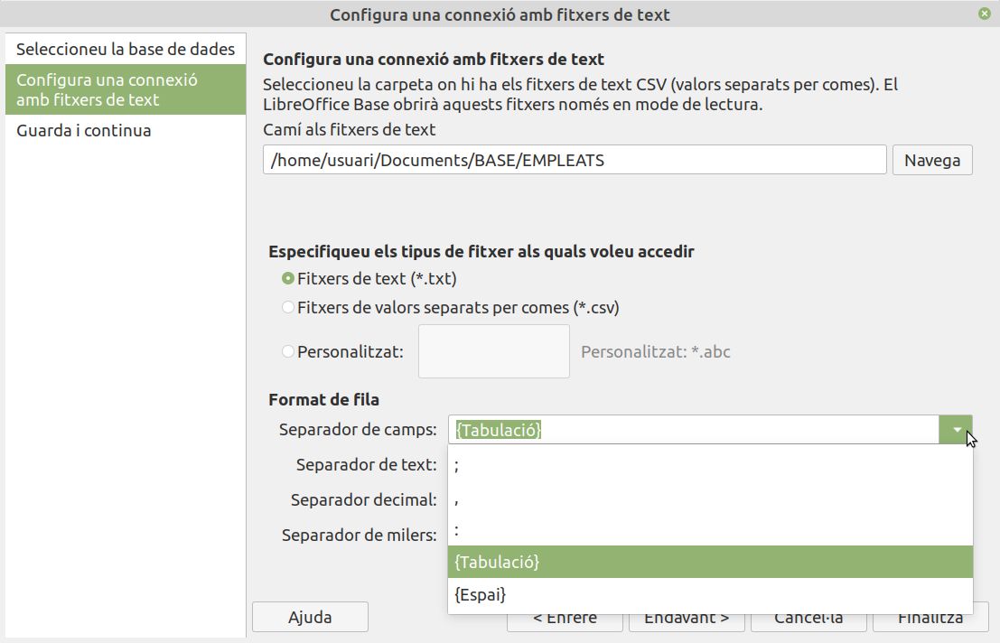

UD12: Bases de dades (II)

# 6. *LibreOffice Base*: Fonts externes. Importació de bases de dades

## 🎯 Objectius

- Obtindre informació de fonts externes de bases de dades. Importar fitxers de text.
- Repassar i aplicar els conceptes vistos anteriorment.

---

# 6.1. Fonts de dades externes

En l'actualitat existeixen multitud de sistemes gestors de bases de dades que permeten organitzar els continguts de manera que siguen fàcilment localitzables. Cadascun d'aquests sistemes es caracteritza perquè tenen el seu propi format d'arxiu de dades per a emmagatzemar les bases de dades que mantenen.

*Base* pot interactuar, mitjançant els manejadors de connexió, amb qualsevol base de dades gestionada per aquests sistemes. Els manejadors de connexió es caracteritzen perquè són capaços d'executar operacions de bases de dades de manera transparent a l'usuari; és a dir, actuen com a intermediaris entre l'usuari i un sistema de bases de dades en particular, de manera que, una vegada establits els paràmetres de connexió, l'usuari no ha de preocupar-se de les particularitats del sistema al qual està connectat.

# 6.2. Importació de bases de dades

*LibreOffice Base*, a més de treballar amb el seu propi format, **és capaç d'importar i obrir bases de dades d'altres programes**. Això ens permet accedir i operar amb totes les dades, evitant la pèrdua d'informació per incompatibilitat.

Per a importar una base de dades seguirem els següents passos:

- Anar al menú `Arxiu` → `Nou` → `Base de dades`.
- Seleccionar l'opció `Connectar amb una base de dades existent`.

Triar el tipus de connexió que volem d'entre les existents. Depenent de la mena de connexió, les pantalles següents canviaran.

## 6.2.1. Formats de bases de dades

- *`Java DataBase Connectivity` (**`JDBC`**)*, és una *API* que permet l'execució d'operacions sobre bases de dades des del llenguatge de programació Java.
- *`Oracle JDBC`*. Es tracta d'una variant de *JDBC* per a *Oracle*.
- *`ActiveX Data Objects` (`ADO`)* és un dels mecanismes que usen els programes de computadores per a comunicar-se amb les bases de dades, donar-los ordres i obtindre resultats d'elles.
- `Full de càlcul`. Permet importar dades d'un full de càlcul.
- *`dBASE`* va ser el primer sistema de gestió de base de dades usat àmpliament per a microcomputadores. Hui dia s'utilitza en aplicacions que necessiten un format simple per a emmagatzemar dades estructurades.
- `Text`. Permet importar dades d'un fitxer de text. La informació ha d'estar en un format determinat, amb dades dividides en columnes i separats per tabuladors o signes de puntuació.
- *`MySQL`*. *MySQL* és un sistema de gestió de bases de dades relacional desenvolupat sota llicència dual *GPL*/Llicència comercial per *Oracle Corporation* i és considerada com la base dades de codi obert més popular del món.
- *`Open DataBase Connectivity` (`ODBC`)* és un estàndard d'accés a les bases de dades desenvolupat per *SQL Access Group (SAG)* en 1992.
- *`PostgreSQL`* és un sistema de gestió de bases de dades relacional orientat a objectes i lliure, publicat sota la llicència *PostgreSQL*, similar a la *BSD* o la *MIT*.
- `Document de Writer`. Permet importar dades d'un document de text.

---

# 📝 *Activitat 6: Importar fitxer de text*

Importarem automàticament les dades contingudes en un fitxer de text pla.
 	
## Descarregar fitxer de text

- Descàrrega el fitxer de text d'empleats. Fes clic amb el botó dret del ratolí en el vincle i tria l'opció Guardar enllaç com. DESCARREGAR
- Crea una nova carpeta `EMPLEATS` dins de la teua carpeta personal `BASE`.
- Còpia el fitxer descarregat a la nova carpeta que has creat.
- Obri el programa `LibreOffice Base`.
- Ve al menú `Arxiu` → `Nou` → `Base de dades`. S'obri l'assistent per a importar dades.

### Pas 1. Seleccionar la base de dades

- Selecciona l'opció `Connectar amb una base de dades existent`.
- Desplega la llista i tria el tipus `Text`.
- Fes clic en el botó `Endavant >`.

### Pas 2. Configurar la connexió

- Fes clic en el botó `Navega` *(Examinar)* i selecciona el fitxer de text (la ruta del lloc on es troba).
- Fes clic a `Finalitza`.

A més, has de seleccionar els caràcters que s'estan utilitzant per a distingir un camp d'un altre en cada fila. En el nostre cas, els camps estan separats per tabuladors. Per això seleccionem, en l'apartat `Separador de camps`, l'opció **`{Tabulació}`**.

- Fes clic en `Endavant >`.

### Pas 3. Guardar la base de dades

- Deixa les opcions per defecte.
- Fes clic en el botó `Finalitza`.
- Guarda la base de dades en la teua carpeta personal amb el nom `Empleats`.
- A continuació, s'obri la nova base de dades creada a partir de la importació del fitxer de text.

Observa que s'ha creat una taula amb les dades dels empleats d'una empresa. Accedeix a la taula `EMPLEAT` i comprova que conté dades.

- Tanca la taula.
- Guarda els canvis.
 	
## Taules i relacions

Si ens fixem, hi ha una columna `Categoria` que defineix les diferents categories de cada empleat. El més lògic seria crear una nova taula i relacionar-la amb la d'empleats.
 	
## Taula EMPLEAT. Definir clau primària

- Defineix el camp `DNI` com a clau primària. 
- Guarda els canvis.
- Tanca la taula.

## Crear taula `CATEGORIA`

- Crea una nova taula `CATEGORIA` i estableix la seua clau primària. Tingues en compte la grandària del camp en la taula `EMPLEAT`.
- Introdueix les diferents categories.
- Guarda els canvis.

## Crear relació

Entre les taules d'EMPLEAT i *CATEGORIA existeix clarament una relació del tipus un a molts (1:N). Donat un empleat, només pot pertànyer a una categoria professional. Donada una categoria, pot tindre molts empleats que pertanyen a ella.

Crea una relació entre les taules EMPRAT i *CATEGORIA. 
Guarda els canvis.
Verificar integritat referencial

Ara comprovem que la relació manté la consistència de les dades.

Veu a la taula *CATEGORIA. Intenta esborrar una categoria a la qual pertanyen diversos empleats.
Veu a la taula *CATEGORIA. Intenta modificar una categoria a la qual pertanyen diversos empleats.
Veu a la taula EMPRAT. Intenta inserir un nou empleat amb una categoria que no existisca en la taula *CATEGORIA.
 	 
Continguts	
Continguts
 	
1. Formularis
Crearem un formulari per a poder manipular dades d'empleats de manera senzilla i intuïtiva.

 	 
Exercicis	
Exercici
 	
Crear formulari

Crea un nou formulari *FEMPLEADO.
Estableix un format de moneda per als camps dels salaris.
Crea una llista desplegable per al camp "*Categoria". 
Crea un camp amb màscara per al DNI, que haurà de contindre 8 dígits. 
Guarda els canvis.
 	 
Continguts	
Continguts
 	
5. Consultes
Crearem consultes sobre la base de dades per a comprovar que tot s'ha importat correctament.

 	 
Exercicis	
Exercici
 	
Crear consulta amb paràmetres

Crea una nova consulta amb nom "CP_*categoria_*emp"
Taula: EMPLEAT
Campos: "Cognom_1", "Cognom_2", "Nom", "Grup_professional" i "Total_nomina"
Ordena ascendentment per "Cognom_1", "Cognom_2" i "Nom"
Que demane com a paràmetre la categoria professional 
Executa la consulta i comprova que funciona correctament.
Guarda els canvis.
Tanca la consulta.
Crear consulta agrupada

Crearem una consulta que mostre el nom de cada categoria emmagatzemada i el total d'empleats que pertanyen a cada categoria.
Crea una nova consulta amb nom "*CG_total_*categoria"
Taula: EMPLEAT
Campos: "*Categoria" i "DNI"
Agrupa per categoria i compte per DNI 
Executa la consulta i comprova que funciona correctament.
Guarda els canvis.
Tanca la consulta.

---

- 💾 Guarda els canvis en la base de dades.
- Tanca la base de dades.
