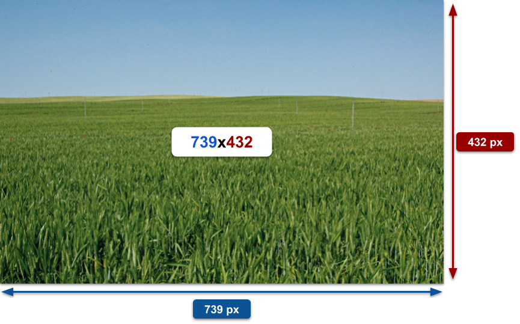
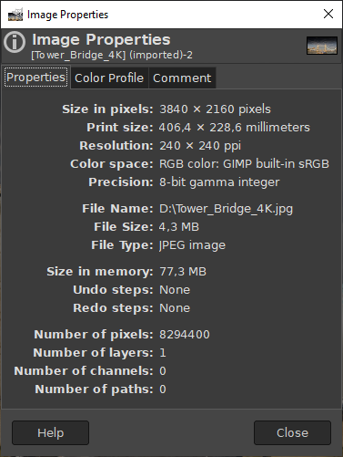
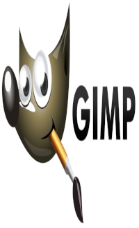
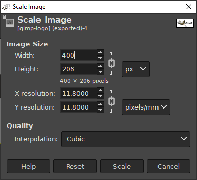
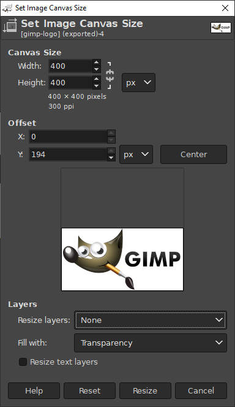
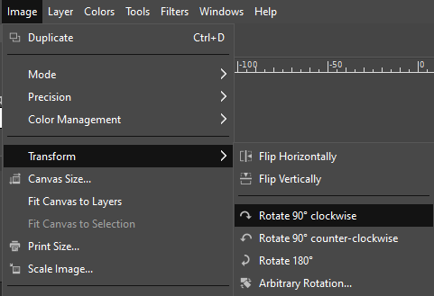
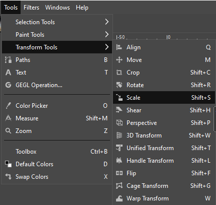
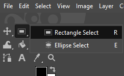
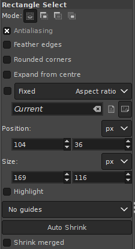

UD13: Imatge digital

# 1. Formats i resolució d'imatges

## 🎯 Objectius

- Conéixer els conceptes bàsics utilitzats en el tractament digital de la imatge.
- Conéixer els tipus d'imatges digitals.
- Elements d'una imatge digital: resolució, grandària, profunditat de color i modes de color.
- Familiaritzar-se amb l'entorn de treball de *GIMP*. Aprendre a personalitzar l'entorn al nostre gust.
- Identificar els principals elements de la interfície d'usuari.
- Localitzar el sistema d'ajuda del programa.

---

# 1.1 Tractament digital d'imatges

En l'actualitat, el desenvolupament tecnològic ha possibilitat un enorme avanç en el món de la fotografia. Les càmeres digitals, els ordinadors i els programes de retoc fotogràfic permeten un ventall de possibilitats impensable tan sols fa uns pocs anys.

El tractament o processament digital correspon al conjunt de tècniques aplicades a les imatges digitals amb l'objectiu de millorar la qualitat, afegir efectes, realitzar muntatges o facilitar la cerca d'informació.

En aquesta unitat introduirem alguns dels conceptes bàsics que s'han de conéixer per a començar a treballar en el món del tractament d'imatges. En els següents apartats definirem conceptes com a píxel, mapa de bits, imatge vectorial i els elements d'una imatge digital.

---

# 1.2 Elements bàsics. Píxel

Wikipedia ens diu: “Un píxel o pixel (acrònim de l'anglés *picture element*, "element d'imatge") és la menor unitat homogènia en color que forma part d'una imatge digital, ja siga aquesta una fotografia, un fotograma de vídeo o un gràfic. Ampliant prou una imatge digital (zoom), per exemple en la pantalla d'un ordinador, poden observar-se els píxels que componen la imatge. Els píxels apareixen com a xicotets quadrats o rectangles en color, en blanc o en negre, o en matisos de gris. Les imatges es formen com una matriu rectangular de píxels, on cada píxel forma una àrea relativament xicoteta respecte a la imatge total”.

En definitiva, la imatge d'una pantalla d'ordinador és com un mosaic amb un número de *pixels* en horitzontal i en vertical. Quan es diu que la pantalla té una resolució de 800 x 600 o 1024 x 768, la primera xifra indica el número de *pixels* en horitzontal que tindrà l'escriptori i la segona xifra els *pixels* en vertical.

Pixelat en fer zoom:

# 1.3. Tipus d'imatges

Podem dividir els tipus d'imatges digitals en dues: imatges de mapa de bits i imatges vectorials. Abans de veure els tipus d'imatges, introduirem el concepte de píxel, fonamental per a entendre el funcionament de la fotografia digital.

---

## 1.3.1. Imatges de mapa de bits

Normalment, els arxius de les imatges es guarden en forma de mapa de bits (mapa de bits en anglés) o mosaic de píxels. Per exemple, els escàners i càmeres digitals creen imatges en aquest format. Aquest tipus d'imatges estan formades per una matriu de punts o raster (una forma quadrangular amb un nombre de píxels en horitzontal i en vertical). Cada píxel guarda la informació de color de la part d'imatge que ocupa.

El principal inconvenient que presenten aquesta classe d'arxius és el de l'ampliació: quan un arxiu s'amplia molt, es distorsiona la imatge, mostrant-se el mosaic amb els *píixels* i una degradació en els colors arribant a aquest efecte *pixelació* a causa de la deformació de la fotografia.

---

## 1.3.2. Imatges vectorials

Wikipedia ens indica que és una “imatge digital formada per objectes geomètrics independents (segments, polígons, arcs, etc.), cadascun d'ells definit per diferents atributs matemàtics de forma, de posició, de color, etc. Per exemple, un cercle de color roig quedaria definit per la posició del seu centre, el seu radi, el gruix de línia i el seu color”. Dit d'una altra manera, es tracta d'imatges formades per multitud de vectors que guarden la seua informació mitjançant expressions matemàtiques.

El principal avantatge d'aquestes imatges és que es poden reduir i ampliar sense perdre qualitat perquè els traços es redibuixen en canviar de grandària. Per tant, es poden moure, estirar, retorçar, etc., de manera senzilla amb les aplicacions que treballen aquest tipus de gràfics. A més, aquesta classe d'arxius ocupen molta menys memòria que les imatges de mapa de bits.

Dibuix vectorial:

---

# 1.4. Propietats de la imatge

## 1.4.1. Resolució

La resolució representa la quantitat de detall que pot observar-se en una imatge, bé siga obtinguda mitjançant escàner, càmera de fotos o impresa. Aquesta quantitat es mesura en ppp (píxels o punts per polzada) o en anglés *dpi* (*dots per inch*). Lògicament, tindre major resolució es tradueix a obtindre una imatge amb més detall o qualitat visual.

>Recordem que 1 polzada = 2,54 cm.

Per a les imatges digitals emmagatzemades com a mapa de bits, la convenció és descriure la resolució de la imatge amb dos nombres enters, on el primer és la quantitat de columnes de píxels (quants píxels té la imatge a l'ample) i el segon és la quantitat de files de píxels (quants píxels té la imatge a l'alt). Per exemple:

---

### 1.4.1.1. Resolució de pantalla

Representa el nombre de píxels per polzada (ppp) que és capaç de mostrar un monitor d'ordinador. La resolució de pantalla ve donada pel producte de l'ample per l'alt, mesurats tots dos en píxels, amb el que s'obté una relació, anomenada relació d'aspecte. Aquesta relació d'aspecte pot variar, ja que està d'acord a la forma del monitor i de la targeta gràfica. Per això, es poden diferenciar dues grandàries de pantalla:

Grandària absoluta: l'amplària i altura de la finestra del monitor, mesurat generalment en polzades. Depén del monitor.
Resolució o grandària relativa: ve determinada pel nombre de píxels que es mostren en la finestra del monitor. Depén de la targeta gràfica.

---

### 1.4.1.2. Resolució d'una càmera digital

La qualitat de resolució de les càmeres digitals s'expressa en **Megapíxels**. Per exemple, una càmera de 12MP pot prendre una fotografia amb 12 milions de píxels. Per a saber quina és la resolució d'una càmera digital hem de conéixer els píxels d'ample x alt als quals és capaç d'obtindre una imatge.

*Exemples:*

Píxels | Resolució
-|-
1600 x 1200 | 1600x1200 = 1.920.000 píxels, és a dir 2 MP
2816x2112 | 2816x2112 = 5.947.392 píxels, és a dir 6 MP

---

### 1.4.1.3. Resolució d'impressió

En una impressora, es refereix al nombre de punts per polzada (ppp) als quals es pot imprimir una imatge digital de qualitat. A partir de 200ppp podem dir que la resolució d'impressió és bona, i si volem assegurar-nos, hem d'aconseguir els 300ppp perquè moltes vegades l'òptica de la càmera, la neteja de l'objectiu o el processador d'imatges de la càmera digital disminueixen la qualitat.

---

### 1.4.1.4. Resolució d'escanejat

Depén dels components de l'escàner i dels paràmetres als quals volem escanejar. El mínim solen ser imatges escanejades amb una resolució per defecte de 200ppp.

---

## 1.4.2. Grandària

Tipus | Significat
-|-
**Grandària digital** | La grandària digital és el **nombre de píxels** (ample x alt) que formen una imatge digital. S'expressa en Megapíxels (milions de píxels).
**Grandària física** | És la grandària física d'una **imatge impresa**; és a dir, són les dimensions reals en termes d'amplària i altura una vegada impresa. Se sol expressar en centímetres o polzades.
**Grandària d'arxiu** | Fa referència a la quantitat de **memòria física** necessària per a guardar una imatge digital en un suport informàtic d'emmagatzematge (disc dur, memòria USB, memòria RAM, etc.).

---

## 1.4.3. Profunditat de color

La profunditat de color es refereix al nombre de bits necessaris per a codificar i guardar la informació de color de cada píxel en una imatge. Com més gran siga la profunditat de color en bits, la imatge disposarà d'una paleta de colors més àmplia i, en conseqüència, es representarà millor.

Un bit és una posició de memòria que pot tindre el valor 0 o 1. En la taula següent podem comprovar el nombre de colors possibles segons el nombre de bits de profunditat de color.

Profunditat (bits) | Núm. de colors
---|---
1  | 2 (blanc i negre) (0=color negre, 1= color blanc)
2  | 4 (00=color negre, 01=color X, 10=color I, 11=color blanc)
4  | 16
8  | 256
16 | 65536
24 | 16,7 milions
32 | 4294 milions

---

# 1.5. Modes de color

Els modes de color defineixen el sistema que utilitzem per a descriure els colors en un entorn determinat. Un model de colors és un model matemàtic abstracte que permet representar els colors en forma numèrica, utilitzant típicament tres o quatre valors o components cromàtics.

Els modes de color més comuns són: escala de grisos, indexat, *RGB*, *HSV* i *CMYK*.

---

## 1.5.1. Escala de grisos

Una escala de grisos és una escala emprada en la imatge digital en la qual el valor de cada píxel posseeix un valor equivalent a una graduació de grisa. Les imatges representades d'aquest tipus estan compostes d'ombres de grisos.

---

## 1.5.2. Indexat

En aquest model, podem especificar els colors amb els quals treballarem amb un màxim de 256 colors. Utilitza un canal de color indexat de 8 bits.

---

## 1.5.3. RGB

RGB (sigles en anglés de *Red, Green, Blue*, en valencià RVA "roig, verd i blau") és un model de color basat en la síntesi additiva, amb el qual és possible representar un color mitjançant la mescla per addició dels tres colors de llum primaris.

La intensitat de cadascuna de les components es mesura segons una escala que va del 0 al 255 i cada color és definit per un conjunt de valors escrits entre parèntesis (corresponents a valors "R", "G" i "B") i separats per comes.

D'aquesta manera, el roig s'obté amb (255,0,0), el verd amb (0,255,0) i el blau amb (0,0,255), obtenint, en cada cas un color resultant monocromàtic. L'absència de color, és a dir el color negre, s'obté quan les tres components són 0: (0,0,0).

---

## 1.5.4. HSV/HSB

El model ***HSV*** (de l'anglés *Hue, Saturation, Value*), també anomenat ***HSB*** (*Hue, Saturation, **Brightness***), defineix un model de color en termes dels seus components. Està basat en la manera en què l'ull humà percep el color, per tant es tracta del mode més "natural".

***Hue*** (Tonalitat). És el valor del color: roig, blau, verd, etc. Es representa com un grau d'angle els valors possibles del qual van de 0 a 360° (encara que per a algunes aplicacions es normalitzen del 0 al 100%). Cada valor correspon a un color. Exemples: 0 és roig, 60 és groc i 120 és verd.

***Saturation*** (Saturació). Es refereix a la puresa del color i va del 0% al 100%. Quant menor siga la saturació d'un color, major tonalitat grisenca hi haurà i més descolorit estarà.

***Value******Brightness*** (Lluminositat). Referència la intensitat de llum del color, és a dir, la quantitat de negre o blanc que conté. Els valors possibles van del 0 al 100%. 0 sempre és negre. Depenent de la saturació, 100 podria ser blanc o un color més o menys saturat.

---

## 1.5.5 CMYK

***CMYK*** (sigles de *Cyan*, *Magenta*, *Yellow* i *Key*) és un model de color sustractiu que s'utilitza en la impressió d'imatges en colors. És la versió moderna i més precisa de l'antic model tradicional de coloració (RYB), que s'utilitza encara en pintura i arts plàstiques. Permet representar una gamma de colors més àmplia que aquest últim, i té una millor adaptació als mitjans industrials.

Aquest model es basa en la mescla de pigments dels següents colors per a crear altres més:

C = *Cyan* (Cian). M = *Magenta* (Magenta). I = *Yellow* (Groc). K = *Black* o *Key* (Negre).

---

## 1.5.6. Usos i colors

Els modes *RGB* (roig, verd i blau), escala de grisos i indexat estan indicats per a imatges el destí de les quals siga una pantalla d'ordinador. Per contra, en el cas que una imatge vaja a ser impresa, podem utilitzar la manera *CMYK*, que és la manera de color utilitzat per les impressores.

Un *pixel* solament pot ser d'un color; quan diem que una imatge és de 256 colors, això indica que un píxel pot tindre un d'aquests 256 colors. Perquè una imatge tinga més de 256 colors ha de treballar en mode *RGB* en el qual un píxel pot ser la combinació d'un dels 256 nivells de roig, 256 nivells de blau i 256 nivells de verd (256 x 256 x 256 = 16.777.216 colors; per això es diu que una imatge *RGB* pot tindre milions de colors). Quants més colors tinga una imatge més ocuparà l'arxiu que la conté.

En general, els programes de retoc fotogràfic treballen en mode *RGB*, perquè s'adapta bé a la pantalla. No obstant això, és possible convertir la imatge a escala de grisos o al mode indexat, però cal tindre present que si una imatge es guarda en escala de grisos o indexat ja no es poden recuperar tots els colors en revertir-la al mode *RGB*. És aconsellable mantindre una còpia del treball en mode *RGB*.

---

# 1.6 Principals formats d'imatge

*GIMP* no treballa amb formats vectorials, però com hem dit abans, és capaç d'obrir quasi tots els tipus d'arxius d'imatge no vectorials. A continuació, repassarem els més importants:

Format | Característiques | Colors | Transparència
-|-|-|-
***JPG/JPEG*** | Va ser desenvolupat per *The Joint Photographers Experts Group*. | És un format de compressió amb pèrdua de qualitat, però es pot ajustar el grau de compressió, la qual cosa permet seleccionar el compromís que existeix entre la grandària d'emmagatzematge i la qualitat de la imatge. És el format del qual s'extrauen les imatges d'una càmera de fotos. Aquesta pèrdua de qualitat s'acumula, cosa que significa que si comprimeix una imatge i la descomprimeix obtindrà una qualitat d'imatge, però si torna a comprimir-la i descomprimir-la una altra vegada obtindrà una pèrdua major. Cada vegada que comprimisca i descomprimisca la imatge perdrà una mica de qualitat. La compressió amb pèrdua no és convenient en imatges o gràfics que tinguen textos o línies i, sobretot, per a arxius que continguen grans àrees de colors sòlids. | Més de 256 | No
***GIF*** | Són les sigles de *Graphics Intercharge Format File*, format desenvolupat per *Compuserve*. | Permet la compressió d'imatges sense pèrdua sempre que tinguen menys de 256 colors. Permet animació i està indicat per a imatges amb grans àrees del mateix color. | Fins a 256 | Sí
***PNG*** | Combina les possibilitats dels dos formats anteriors, per la qual cosa comença a ser bastant utilitzat. Es tracta d'un format basat en un algorisme de compressió sense pèrdua i no subjecte a patents. | Ha sigut triat com a estàndard gràfic per a la Web pel W3C. | Més de 256 | Sí
***TIFF*** | Aquestes són les sigles de *Tag Image File Format* i és el format d'imatge d'ús més estés. Va ser desenvolupat per l'empresa *Aldus*, la creadora de *PageMaker*. L'objectiu era crear un format àmpliament compatible amb totes les plataformes. | Més de 256 | No
***BMP*** | És el format propi del programa *Microsoft Paint*, que ve amb el sistema operatiu *Windows*. Pot guardar imatges de 24 bits (milions de colors), 8 bits (256 colors) i menys. L'ús més comú d'aquest format és generar imatges de poc pes per a crear fons per a l'escriptori de *Windows*. | Més de 256 | No

## 1.1.6 Format *XCF*

Un cas especial és l'arxiu de tipus *XCF*. Aquest és el format propi de *GIMP*. El que fem, sobretot si té capes (espècie de fulles que se sobreposen en una imatge i en la qual cada fulla aporta una part del dibuix), o simplement perquè no hem acabat de treballar amb l'arxiu, és convenient que es guarde en aquest format. Després ja es guardarà en un altre més adequat per als nostres fins. Sempre podrem recuperar l'arxiu *xcf, modificar-lo i exportar el nostre treball a arxius en un altre format.

---

# 1.7 Programa de retoc d'imatges de GNU - *GIMP*

El *GIMP* és una eina de retoc fotogràfic multiplataforma. El *GIMP* és un acrònim de ***GNU Image Manipulation Program***. Al *GIMP* es poden dur a terme tota mena de tasques de retoc d'imatges, incloent-hi el retoc fotogràfic, la composició i la creació d'imatges.

El *GIMP* té moltes capacitats. Es pot usar com un senzill programa de pintura, un programa de retoc fotogràfic professional, un sistema en línia de procés per lots, un generador d'imatges per a producció en sèrie, un convertidor de formats d'imatges, etc.

El *GIMP* és ampliable i extensible. Està dissenyat per ampliar-se amb connectors i extensions. La interfície avançada de scripts permet automatitzar des de les tasques més simples fins als procediments més complexos de manipulació d'imatges.

Un dels punts forts del *GIMP* és la seva lliure disponibilitat des de diverses fonts per a molts sistemes operatius. Gairebé totes les distribucions de GNU/Linux inclouen el *GIMP* com una aplicació estàndard. El *GIMP* també està disponible per a altres sistemes operatius com *Microsoft Windows™* o *Mac OS X™(Darwin)* d'*Apple*. El *GIMP* és una aplicació de programari lliure coberta per la Llicència Pública General [GPL](https://www.gnu.org/licenses/gpl-3.0.html). La GPL ofereix als usuaris la llibertat d'accedir i modificar el codi font amb què es construeixen els programes.

📄 [**Documentació oficial GIMP**](https://docs.gimp.org/2.10/ca/)

▶ [*Exemple d'edició amb GIMP i Blender*](https://youtu.be/2w002xat6SY)

---

## 1.7.1 [Finestres principals](https://docs.gimp.org/2.10/ca/gimp-concepts-main-windows.html)

---

## 1.7.2 El sistema d'ajuda del *GIMP*

L'Equip de Documentació del *GIMP* i altres usuaris us proporcionen la informació necessària per entendre com usar el *GIMP*. El manual d'usuari és una part important d'aquest document. La versió actual es troba en el lloc web de l'Equip de Documentació [GIMP-DOCS](https://www.gimp.org/docs/) en format *HTML*. La versió *HTML* també està disponible com a ajuda contextual mentre es fa servir el *GIMP* prement la tecla `F1`. Es pot accedir a l'ajuda d'elements específics del menú prement `F1` mentre el punter del ratolí enfoca en aquest element.

---

# 1.8 Eines de *GIMP*

## 1.8.1 Propietats d'una imatge

En `Image` > `Image properties` podem examinar les propietats d'una imatge:

Podem observar la diferència entre la grandària de l'arxiu `File Size` i la grandària que ocupa la imatge en memòria principal `Size in memory`. També és interessant la resolució i la grandària física d'impressió `Print size`.

---

## 1.8.2 Redimensionar imatges

Una de les operacions més comunes és la de canviar la grandària d'una imatge. Hem de tindre en compte diversos factors:

- Si fem la imatge més gran, perdrem qualitat.

- Si canviem la relació d'aspecte, la imatge es veurà deformada. En general haurem de redimensionar les imatges de manera proporcional.

Per a redimensionar una imatge anirem a `Image` > `Scale image...`, apareixerà un diàleg per a posar els paràmetres.

---

## 1.8.3 Canviar grandària del llenç (*Canvas*)

Una altra manera de canviar la grandària d'una imatge és canviar la grandària del "full" en la qual està "dibuixada", és a dir, del llenç (o *canvas* en anglés). Aquesta tècnica realment no modifica el contingut de la imatge sinó que fa que la superfície que podem usar en ella siga més gran o més xicoteta.

Si reduïm el llenç perdrem part de la imatge, però si l'ampliem guanyarem espai per a treballar.

Per a canviar la grandària del llenç anirem a `Image` > `Canvas Size...`

---

## 1.8.4 Eines de transformació

En `Image` > `Transform` tenim les opcions més comuns:

- `Flip Horizontally` Capgira horitzontalment (efecte espill)
- `Flip Vertically` Capgira vertigalment
- `Rotate 90º clockwise` Gira 90º en sentit horari
- `Rotate 90º counter-clockwise` Gira 90º en sentit antihorari
- `Rotate 180º` Gira 180º

En `Tools` > `Transform Tools` tenim opcions avançades de transformació.

- `Move` Mou la imatge
- `Crop` Retallar
- `Rotate` Girar lliurement
- `Scale` Escalar
- `Shear` Inclina
- `3D Transform` Transformació 3D
- `Cage transform` Transformar regió

---

## 1.8.5 Eines de selecció geomètrica

Una selecció és un contorn tancat amb el qual podem realitzar operacions (moure-la, copiar-la, etc.). *GIMP* ens ofereix moltes eines de selecció, però en aquest apartat ens centrarem en les eines de selecció geomètriques. Aquestes eines permeten seleccionar amb formes rectangulars i ovalades. Quan se selecciona alguna cosa, apareix la selecció “emmarcada” amb una línia que es mou (a aquest efecte se'l coneix com a “formigues en marxa”).

Les eines de selecció les tenim en la Caixa d'eines o amb el menú `Tools` → `Selection Tools`. Les dues eines que utilitzarem seran la selecció rectangular `Rectangle Select` i la Selecció el·líptica `Ellipse Select`.

### Operacions de copiar i pegar

Per a comprovar algunes de les accions d'aquesta mena d'eines i el seu potencial, hem de saber com copiar i pegar en un altre document una selecció. Aquesta operació és molt senzilla i tenim 2 opcions possibles.

#### Copiar i pegar en una altra capa o en una altra imatge

Seleccionar una zona amb una eina de selecció.
Copiar-la al portapapers. Tenim diversos procediments: *Ctrl+C*, botó dret sobre la selecció i en el menú emergent `Edit` → `Copy`
Pegar-la en una altra capa o imatge amb el *Ctrl+V*.

#### Crear un document nou amb una selecció

Seleccionar una zona amb una eina de selecció.
Copiar-la al portapapers.
Anar al menú `Edit` → `Paste as` → `New Image`.

### Procediments comuns

Les eines de selecció estan dissenyades per a seleccionar regions de les imatges i així poder treballar en elles sense que les àrees no seleccionades es vegen afectades. Cada eina té les seues propietats particulars, però les eines de selecció comparteixen, a més, algunes característiques, com les tecles modificadores.

El comportament de les eines de selecció es modifica si es pressiona tecles especials com `Ctrl`, `Shift`, i/o Alt` mentre s'utilitzen:

Tecla premuda | Funcionalitat de la selecció
-|-
`Ctrl` | En crear una selecció, mantindre pressionada la tecla `Ctrl` pot tindre dos efectes diferents en funció de quan es prema:
| | - Si es manté pressionada la tecla abans de fer clic per a començar a seleccionar, aquesta selecció es realitzarà en la manera d'extracció.
| | - Si es manté pressionada la tecla després de fer clic per a començar a seleccionar, l'efecte dependrà de l'eina que estiga en ús.
`Alt` | Mantindre pressionada `Alt` permet moure el marc de la selecció sense el seu contingut. Si es mou tota la imatge en comptes de moure's només la selecció, intenta `Shift`+`Alt`.
`Shift` | En crear una selecció, mantindre pressionada la tecla `Shift` pot tindre dos efectes diferents en funció de quan es prema:
| | Si es manté pressionada la tecla abans de fer clic per a començar a seleccionar, aquesta selecció es realitzarà en la manera d'addició.
| | Si es manté pressionada la tecla després de fer clic per a començar a seleccionar, l'efecte dependrà de l'eina que estiga en ús: per exemple, la forma de la selecció es restringeix a un quadrat per a l'eina de selecció rectangular.
`Ctrl`+`Shift` | La combinació `Ctrl`+`Shift` pot fer una varietat de coses depenent de l'eina que estiga en ús. És comú a totes les eines que la manera de selecció es canvie a intersecció, i fa que quan la selecció finalitze, aquesta consistisca en la intersecció de la regió traçada amb la selecció que existia amb anterioritat.
`Barra espaiadora` | Si es pressiona la barra d'espais mentre s'utilitza qualsevol eina de selecció, es canvia momentàniament a l'eina per a moure fins que la tecla s'allibere.

### Eina selecció rectangular Eina selecció rectangular

Com el seu propi nom indica, permet realitzar seleccions amb forma rectangular.

#### Opcions

Les opcions que ens ofereix aquesta eina, **perquè tinguen efecte, han de configurar-se ABANS de fer la selecció**.

- **Mode**. Determina la forma en què la selecció que es crea es combina amb qualsevol selecció existent amb anterioritat.

  - ***Replace***: Mode reemplaçar fa que qualsevol selecció existent siga reemplaçada quan una es realitze una nova selecció.
  - **Add**: Mode afegir fa que la selecció que es faça s'afija a qualsevol selecció existent.
  - **Subtract**: Mode extracció esborra la selecció que es faça dins d'una selecció existent.
  - **Intersect**: Mode intersecció fa una selecció nova de l'àrea en què se solapen una nova selecció creada amb una existent.

- **Antialiasing**: Allisat. Aquesta opció, que només afecta a unes poques eines de selecció, fa que els contorns de la selecció es dibuixen més suaument.
- **Feather edges**: Difuminar les vores. Aquesta opció permet difuminar el contorn de la selecció, de manera que els punts pròxims al contorn es vegen parcialment *difunimados. D'aquesta manera s'obtenen transicions uniformes i agradables, evitant que les vores apareguen dentats a l'hora de tallar aquella selecció creada i pegar-la en un altre document. Si seleccionem aquesta opció, hem de definir el Radi amb el qual actuarà. A més radi, més zona difuminada.
- **Rounded corners**: Esquinas arredonides. Literalment, arredoneix les cantonades de la selecció. També cal configurar el paràmetre Ràdio. A més radi, més arrodoniment es produeix. En la imatge hem donat un valor de 68 al Radi. Una vegada hem creat la selecció amb l'eina Selecció rectangular, ens fixem que les cantonades s'arredoneixen.
- **Expand from centre**: Expandir des del centre. Permet que el punt en el qual es faça clic es convertisca en el centre de la selecció (equival a pressionar la tecla *Ctrl després de fer clic).
- **Fixed**. Fix. Aquest menú permet limitar la forma de la selecció de diferents formes:
  - Proporció d'aspecte. Aquesta opció li permet dissenyar i modificar la grandària de la selecció mentre es manté fixa la relació d'aspecte que apareix en la casella. Per defecte, la relació és de 1:1 (pel que tenim un quadrat). Si introduïm, per exemple 2:1 la selecció que fem tindrà el doble d'amplària que d'altura.
  - Amplària. Podem triar l'amplària que desitgem per a la selecció.
  - Altura. Podem triar l'altura que desitgem per a la selecció.
  - Grandària. Amb aquesta opció podem especificar una altura i amplària determinada per a la selecció.
- **Highlight**: Ressaltat. Si s'habilita aquesta opció l'àrea seleccionada es destaca en emmarcar-se amb una màscara que envolta a la selecció.
- **Guides**: Guies. Per a facilitar la creació de la selecció, mitjançant aquest menú es pot seleccionar diferents tipus de guies.
- **Auto Shrink**: Encongir automàticament. Aquesta opció li permet realitzar un “encongit automàtic” a la figura més pròxima que hàgem emmarcat dins de la selecció (que es trobe en la mateixa capa).
- **Shrink merged**: Encongir combinat. Permet utilitzar la informació dels píxels visibles de la imatge (no sols de la capa activa).

#### Modificar selecció

Quan es realitza una selecció, apareixen les “formigues en marxa” emmarcant la zona seleccionada. Aqueixa selecció pot ser modificada. Passos:Selecció

- Desplaçar el ratolí damunt dels quadrats de les cantonades de la selecció fins a comprovar que el punter canvia.
- Arrossegar el ratolí per a canviar la selecció en altura i amplària al mateix temps.
- Si vols canviar la selecció en amplària o altura de manera independent, desplaça el punter del ratolí al lateral de la selecció (entre els quadrats). Apareixerà una zona rectangular que permetrà modificar la selecció en amplària o altura.

### Eina selecció el·líptica Eina selecció el·líptica

Aquesta eina funciona de manera similar a l'anterior, però en el seu lloc, crea una el·lipse o un cercle prement la tecla `Shift`. Les opcions són pràcticament idèntiques.

### Àrea seleccionada. Accions possibles

Quan una part de la imatge està seleccionada, només podrem modificar aquesta part de la imatge.

---

# Activitat 1: Introducció a GIMP

Per a treballar en classe descarregarem una versió portable de *GIMP*

- [Descàrrega GIMP 2.10.25 AppImage](https://github.com/aferrero2707/gimp-appimage/releases/download/continuous/GIMP_AppImage-git-2.10.25-20210610-x86_64.AppImage)

- Guarda l'arxiu a l'escriptori i dona-li permiso d'execució.

Per a poder seguir les pràctiques usarem la versió 2.10 de *GIMP* i l'idioma en anglés. Com som usuaris avançats utilitzarem la *GIMP* en anglés, ja que la majoria de recursos i tutorials d'Internet utilitzen aquest llenguatge

- Obri *GIMP*, fent doble clic en el fitxer descarregat.
- Ve a `Edit` > `Preferences`, en Interface en l'apartat `Language` posa `English [en_US]`. Haurem de reinicia l'aplicació.

Modo ventana única.  En les últimes versions, per defecte la manera "Finestra única" que integra tots els panells d'eines i edició en una sola finestra.
Però si tenim una configuració antiga emmagatzemada en el nostre perfil d'usuari, pot ser que ens apareguen els panells en finestres separades.

- Ve a `Windows` i comprova que l'opció `Wingle-Window mode` està marcada.

Ara canviarem l'opció de comentari per a posar el nostre nom en les nostres imatges.

- Ve a `Edit` > `Preferences`, en `Default Image` canvia el paràmetre `Comment` i posa el teu **nom i cognoms**.

---

- Descarrega la següent imatge:

La imatge té unes dimensions de `3840x2160`, aquest tipus d'imatges es diuen ***4k*** perquè la seua amplària està pròxima als 4000 *pixels*.

Anem a canviar la mida de la imatge a 640x360.

- Ve a Image > Scale image... i posa en *Width:* `640` i en *Height:* `360`, la resta d'opcions per defecte.
- Fes clic en `Scale` i espera que termine el process.

Ara la imatge es veurà molt xicoteta, però podem adaptar el zoom.
Podem gastar diverses opcions:

- Tecla `1` per a 100%
- Tecles `+` i `-`
- Usar la roda del ratolí amb la tecla `Ctrl`.
- Anar al menú `View` > `Zoom...`

Ara transformarem la imatge voltejant-la horitzontalment.

- `Image` > `Transform` > `Flip Horizontally`

Guarda els canvis.

- `File` > `Save As...` i posa-li el nom `ud13_act1.xcf`

Exporta la imatge al format `jpg`

- `File` > `Export As...` posa-li el nom `ud13_act1.jpg`
- En `Quality` posa `55`
- En `Comment` posa el teu nom i cognoms

Exporta la imatge al format `png`

- `File` > `Export As...` posa-li el nom `ud13_act1.png`
- Deixa les opcions per defecte.

Lliura els arxius `xcf`, `jpg` i `png` creats.
